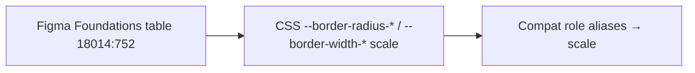

# Borders

## Figma source

- Canonical design-system Figma (Web-ODS-Theme — Borders): https://www.figma.com/design/Nshd9ukxIzpeUnzOXiWxUP/Web-ODS-Theme?node-id=18014-752&m=dev

## Summary

Border foundation covering **two families** (radius + width). The canonical CSS surface matches the Figma Foundations size scale on Web-ODS-Theme node `18014:752` — `border-radius-{0,xs,s,m,l,xl,xxl,xxxl}` and `border-width-{0,xs,s,m,l,xl}`. Values are shared across brands via `themes/default/_borders.scss` and the multi-brand contract.

Counts at a glance:

- **8 radius scale tokens** — `0 / xs / s / m / l / xl / xxl / xxxl`
- **6 width scale tokens** — `0 / xs / s / m / l / xl`
- **14 contract tokens total**
- Plus **compat role aliases** (not in contract) for older component CSS: `control` / `card` / `dialog` / `pill` and `none` / `hairline` / `default` / `emphasis` / `focus`

## Layered model



## Token values

### Border radius — size scale (8)

| Figma name | Value | CSS custom property | Notes |
|---|---|---|---|
| `border-radius-0` | `0` | `--border-radius-0` | sharp corners |
| `border-radius-xs` | `2px` | `--border-radius-xs` | |
| `border-radius-s` | `4px` | `--border-radius-s` | |
| `border-radius-m` | `6px` | `--border-radius-m` | |
| `border-radius-l` | `8px` | `--border-radius-l` | |
| `border-radius-xl` | `16px` | `--border-radius-xl` | |
| `border-radius-xxl` | `24px` | `--border-radius-xxl` | |
| `border-radius-xxxl` | `30px` | `--border-radius-xxxl` | Used for button focus state only (Figma note) |

### Border width — size scale (6)

| Figma name | Value | CSS custom property | Notes |
|---|---|---|---|
| `border-width-0` | `0` | `--border-width-0` | |
| `border-width-xs` | `1px` | `--border-width-xs` | |
| `border-width-s` | `2px` | `--border-width-s` | |
| `border-width-m` | `4px` | `--border-width-m` | |
| `border-width-l` | `6px` | `--border-width-l` | |
| `border-width-xl` | `8px` | `--border-width-xl` | |

### Compat role aliases (theme-only, not in contract)

| Alias | Resolves to |
|---|---|
| `--border-radius-control` | `var(--border-radius-s)` |
| `--border-radius-card` | `var(--border-radius-l)` |
| `--border-radius-dialog` | `var(--border-radius-xl)` |
| `--border-radius-pill` | `9999px` |
| `--border-width-none` | `var(--border-width-0)` |
| `--border-width-hairline` | `var(--border-width-xs)` |
| `--border-width-default` | `var(--border-width-s)` |
| `--border-width-emphasis` | `var(--border-width-m)` |
| `--border-width-focus` | `var(--border-width-m)` |

## CSS implementation pattern

```css
:root {
  --border-radius-0: 0;
  --border-radius-xs: 2px;
  --border-radius-s: 4px;
  --border-radius-m: 6px;
  --border-radius-l: 8px;
  --border-radius-xl: 16px;
  --border-radius-xxl: 24px;
  --border-radius-xxxl: 30px;

  --border-width-0: 0;
  --border-width-xs: 1px;
  --border-width-s: 2px;
  --border-width-m: 4px;
  --border-width-l: 6px;
  --border-width-xl: 8px;
}
```

Canonical source on disk: `themes/default/_borders.scss` (re-exported by `src/tokens/borders/_borders.scss`).

## Design decisions

1. **Figma Foundations table is canonical** — CSS token names match the doc-page captions (`border-radius-s`, not a separate role vocabulary).
2. **Radius ramp `0 → 2 → 4 → 6 → 8 → 16 → 24 → 30`** preserved verbatim from Figma, including the uneven 8 → 16 jump and `xxxl = 30` (button focus only).
3. **Width ramp `0 → 1 → 2 → 4 → 6 → 8`** preserved verbatim; odd-px steps are not in Figma.
4. **Role aliases kept as compat** — older LifeLock components still reference `--border-radius-control` etc.; those alias onto the Figma scale (or `9999px` for pill).
5. **Shared across brands** — default theme / other brand / other brand / LifeLock ship the same scale values.
6. **All tokens single-value** — no per-mode overrides.
