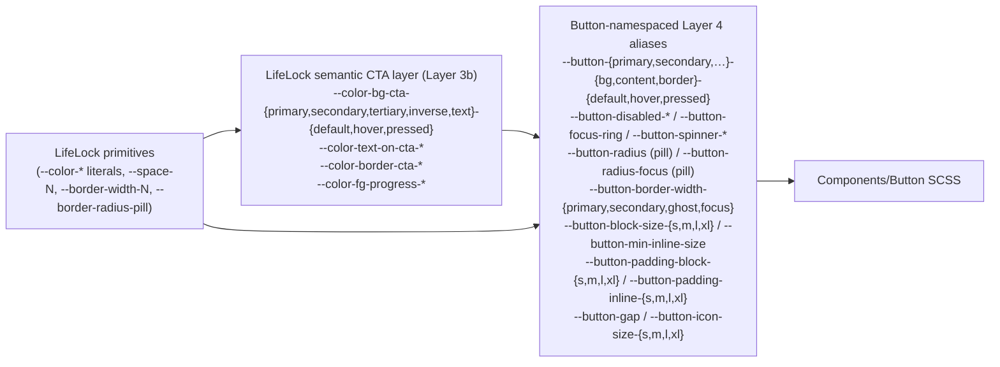

# Button

Component-token unit governing the LifeLock Button surface vocabulary —
per-type / per-state surface paints, per-size geometry, focus ring, and
spinner colours. Every value here is a **Layer 4 alias** pointing at an
already-published LifeLock semantic token (Layer 3b CTA color extension
in [`tokens/colors/spec.md`](../colors/spec.md), or a primitive from
[`tokens/borders/spec.md`](../borders/spec.md) / [`tokens/spacing/spec.md`](../spacing/spec.md)).
No new primitives are introduced. The unit exists so a future
re-target of one button-state surface only requires editing this file
without touching either the colors token or the button component.

## Figma source

- Canonical design-system Figma (Web-ODS-Theme — Design System & tokens, source of every aliased Layer 3b CTA token): <https://www.figma.com/design/Nshd9ukxIzpeUnzOXiWxUP/Web-ODS-Theme>
- Canonical button master variant set (Web-ODS Shared Library, source of the per-type / per-state / per-size combinations these tokens are sized for): [`2434:14483`](https://www.figma.com/design/0o8SL5BEk8wHtgud00dRyg/Web-ODS-Shared-Library?node-id=2434-14483&m=dev)
- Spec / gallery frame (the user-supplied URL — visual matrix of every variant the tokens paint): [`1332:31438`](https://www.figma.com/design/0o8SL5BEk8wHtgud00dRyg/Web-ODS-Shared-Library?node-id=1332-31438&m=dev)

## Summary

Single-theme, layer-4 aliases. The token surface owns:

- **42 per-type surface tokens** — 6 colour tokens × 7 types (`primary` / `secondary` / `tertiary` / `inverse` / `text` / `primary-ghost` / `secondary-ghost`) covering `bg-default` / `bg-hover` / `bg-pressed` / `content-default` / `content-hover` / `content-pressed`, plus a `border` token per type (49 tokens total in the per-type group; some types share values across states for keyline-only types like Text + Ghost).
- **3 universal disabled tokens** — `--button-disabled-bg` / `--button-disabled-content` / `--button-disabled-border`.
- **1 focus ring token** — `--button-focus-ring` aliasing `--color-border-focus`.
- **2 spinner tokens** — `--button-spinner-track` / `--button-spinner-fill` aliasing `--color-fg-progress-{track,fill}`.
- **2 corner-radius tokens** — `--button-radius` and `--button-radius-focus`, both aliasing `--border-radius-pill` (9999 px). The LifeLock-themed master ships a pill radius on every size; the focus outline shares the surface shape.
- **4 border-width tokens** — `--button-border-width-primary` / `-secondary` / `-ghost` / `-focus`. Primary aliases `--border-width-none`; Secondary / Ghost / Focus alias `--border-width-default` (2 px).
- **4 per-size block-size tokens** — `--button-block-size-{s,m,l,xl}` (FIXED outer height per size — 24 / 36 / 40 / 48 px — mirroring Figma auto-layout's fixed-height behaviour rather than letting `padding-block + line-height` determine the box).
- **1 min-inline-size token** — `--button-min-inline-size` (48 px floor; suppressed on icon-only).
- **9 per-size padding + gap tokens** — block padding × 4 sizes + inline padding × 4 sizes + 1 universal gap.
- **4 icon-slot size tokens** — `--button-icon-size-{s,m,l,xl}`.

Total: ~70 tokens, all aliases.

## Layered model



The `Components/Button` SCSS reads only `--button-*` names — it never
reaches across into the CTA semantics directly. That keeps the
component CSS stable when the Figma side eventually publishes
button-namespaced **Variables** (`Button/primary/bg-default`, etc.) —
the only delta will be one `var(--color-bg-cta-...)` in this file
flipping to `var(--button-color-bg-default)` (or similar) without the
component noticing.

## Token values

> The full table is the canonical surface; sync skills parse this
> table verbatim (per [`spec-md-conventions.mdc`](../../../../.cursor/rules/spec-md-conventions.mdc)
> "Reading contract for sync skills"). The CSS implementation in
> `_button.scss` mirrors this table 1-to-1.

### Per-type surface paints

| Figma name | Figma type | Value | CSS custom property | Notes |
|---|---|---|---|---|
| `Button/primary/bg-default` | Color (alias) | `var(--color-bg-cta-primary-default)` (= `#013638` LifeLock green) | `--button-primary-bg-default` | Surface fill at default |
| `Button/primary/bg-hover` | Color (alias) | `var(--color-bg-cta-primary-hover)` (= `#161616` off-black) | `--button-primary-bg-hover` | Surface fill on hover |
| `Button/primary/bg-pressed` | Color (alias) | `var(--color-bg-cta-primary-pressed)` (= `#108389` ocean-teal) | `--button-primary-bg-pressed` | Surface fill on press |
| `Button/primary/content-default` | Color (alias) | `var(--color-text-on-cta-primary)` (= `#fff`) | `--button-primary-content-default` | Label + icon paint |
| `Button/primary/content-hover` | Color (alias) | `var(--color-text-on-cta-primary)` | `--button-primary-content-hover` | Same as default — Primary keeps white-on-dark across states |
| `Button/primary/content-pressed` | Color (alias) | `var(--color-text-on-cta-primary)` | `--button-primary-content-pressed` | Same as default |
| `Button/primary/border` | Color (alias) | `var(--color-bg-cta-primary-default)` | `--button-primary-border` | Keyline-invisible (matches surface); border-width is 0 |
| `Button/secondary/bg-default` | Color (alias) | `var(--color-bg-cta-secondary-default)` (= `#f8f8f7` neutral-5) | `--button-secondary-bg-default` | |
| `Button/secondary/bg-hover` | Color (alias) | `var(--color-bg-cta-secondary-hover)` (= `#cce5e7` mist-blue) | `--button-secondary-bg-hover` | |
| `Button/secondary/bg-pressed` | Color (alias) | `var(--color-bg-cta-secondary-pressed)` (= `#e2e2e2` cool-gray) | `--button-secondary-bg-pressed` | |
| `Button/secondary/content-default` | Color (alias) | `var(--color-text-on-cta-secondary)` (= `#013638`) | `--button-secondary-content-default` | |
| `Button/secondary/content-hover` | Color (alias) | `var(--color-text-on-cta-secondary)` | `--button-secondary-content-hover` | |
| `Button/secondary/content-pressed` | Color (alias) | `var(--color-text-on-cta-secondary)` | `--button-secondary-content-pressed` | |
| `Button/secondary/border` | Color (alias) | `var(--color-border-cta-secondary)` (= `#013638`) | `--button-secondary-border` | 2px visible keyline |
| `Button/tertiary/bg-default` | Color (alias) | `var(--color-bg-cta-tertiary-default)` (= `#e8e1cf` sand) | `--button-tertiary-bg-default` | |
| `Button/tertiary/bg-hover` | Color (alias) | `var(--color-bg-cta-tertiary-hover)` (= `#c6ae94` warm-stone) | `--button-tertiary-bg-hover` | |
| `Button/tertiary/bg-pressed` | Color (alias) | `var(--color-bg-cta-tertiary-pressed)` (= `#fef9ee` ivory) | `--button-tertiary-bg-pressed` | |
| `Button/tertiary/content-default` | Color (alias) | `var(--color-text-on-cta-tertiary)` (= `#013638`) | `--button-tertiary-content-default` | |
| `Button/tertiary/content-hover` | Color (alias) | `var(--color-text-on-cta-tertiary)` | `--button-tertiary-content-hover` | |
| `Button/tertiary/content-pressed` | Color (alias) | `var(--color-text-on-cta-tertiary)` | `--button-tertiary-content-pressed` | |
| `Button/tertiary/border` | Color (alias) | `var(--color-bg-cta-tertiary-default)` | `--button-tertiary-border` | Keyline-invisible |
| `Button/inverse/bg-default` | Color (alias) | `var(--color-bg-cta-inverse-default)` (= `#108389` ocean-teal) | `--button-inverse-bg-default` | |
| `Button/inverse/bg-hover` | Color (alias) | `var(--color-bg-cta-inverse-hover)` (= `#013638` lifelock-green) | `--button-inverse-bg-hover` | |
| `Button/inverse/bg-pressed` | Color (alias) | `var(--color-bg-cta-inverse-pressed)` (= `#161616` off-black) | `--button-inverse-bg-pressed` | |
| `Button/inverse/content-default` | Color (alias) | `var(--color-text-on-cta-inverse)` (= `#fff`) | `--button-inverse-content-default` | |
| `Button/inverse/content-hover` | Color (alias) | `var(--color-text-on-cta-inverse)` | `--button-inverse-content-hover` | |
| `Button/inverse/content-pressed` | Color (alias) | `var(--color-text-on-cta-inverse)` | `--button-inverse-content-pressed` | |
| `Button/inverse/border` | Color (alias) | `var(--color-bg-cta-inverse-default)` | `--button-inverse-border` | Keyline-invisible |
| `Button/text/bg-default` | Color | `transparent` | `--button-text-bg-default` | No surface at default |
| `Button/text/bg-hover` | Color (alias) | `var(--color-bg-cta-text-hover)` (= `#f8f8f7` neutral-5) | `--button-text-bg-hover` | Tonal hover overlay |
| `Button/text/bg-pressed` | Color (alias) | `var(--color-bg-cta-text-pressed)` (= `#e3e3e2` neutral-10) | `--button-text-bg-pressed` | Tonal pressed overlay |
| `Button/text/content-default` | Color (alias) | `var(--color-text-on-cta-text)` (= `#013638`) | `--button-text-content-default` | |
| `Button/text/content-hover` | Color (alias) | `var(--color-text-on-cta-text)` | `--button-text-content-hover` | |
| `Button/text/content-pressed` | Color (alias) | `var(--color-text-on-cta-text)` | `--button-text-content-pressed` | |
| `Button/primary-ghost/bg-default` | Color | `transparent` | `--button-primary-ghost-bg-default` | Identity colour stays on the keyline + label |
| `Button/primary-ghost/bg-hover` | Color (alias) | `var(--color-bg-cta-secondary-hover)` (= mist-blue) | `--button-primary-ghost-bg-hover` | Existing tonal overlay per Figma description |
| `Button/primary-ghost/bg-pressed` | Color (alias) | `var(--color-bg-cta-secondary-pressed)` (= cool-gray) | `--button-primary-ghost-bg-pressed` | |
| `Button/primary-ghost/content-default` | Color (alias) | `var(--color-bg-cta-primary-default)` (= lifelock-green) | `--button-primary-ghost-content-default` | Label + icon + keyline share this colour (consumer drives `border-color: currentColor`) |
| `Button/primary-ghost/content-hover` | Color (alias) | `var(--color-bg-cta-primary-default)` | `--button-primary-ghost-content-hover` | |
| `Button/primary-ghost/content-pressed` | Color (alias) | `var(--color-bg-cta-primary-default)` | `--button-primary-ghost-content-pressed` | |
| `Button/primary-ghost/border` | Color (alias) | `var(--color-bg-cta-primary-default)` | `--button-primary-ghost-border` | 2px visible keyline |
| `Button/secondary-ghost/bg-default` | Color | `transparent` | `--button-secondary-ghost-bg-default` | |
| `Button/secondary-ghost/bg-hover` | Color (alias) | `var(--color-bg-cta-secondary-hover)` | `--button-secondary-ghost-bg-hover` | |
| `Button/secondary-ghost/bg-pressed` | Color (alias) | `var(--color-bg-cta-secondary-pressed)` | `--button-secondary-ghost-bg-pressed` | |
| `Button/secondary-ghost/content-default` | Color (alias) | `var(--color-text-on-cta-secondary)` (= lifelock-green) | `--button-secondary-ghost-content-default` | |
| `Button/secondary-ghost/content-hover` | Color (alias) | `var(--color-text-on-cta-secondary)` | `--button-secondary-ghost-content-hover` | |
| `Button/secondary-ghost/content-pressed` | Color (alias) | `var(--color-text-on-cta-secondary)` | `--button-secondary-ghost-content-pressed` | |
| `Button/secondary-ghost/border` | Color (alias) | `var(--color-text-on-cta-secondary)` | `--button-secondary-ghost-border` | 2px visible keyline (= content) |

### Universal state paints

| Figma name | Figma type | Value | CSS custom property | Notes |
|---|---|---|---|---|
| `Button/disabled/bg` | Color (alias) | `var(--color-bg-cta-disabled)` (= `#e3e3e2` neutral-10) | `--button-disabled-bg` | Universal across every Type |
| `Button/disabled/content` | Color (alias) | `var(--color-text-on-cta-disabled)` (= `#888887` neutral-50) | `--button-disabled-content` | |
| `Button/disabled/border` | Color (alias) | `var(--color-border-cta-disabled)` (= `#b6b6b5` neutral-30) | `--button-disabled-border` | Mostly invisible on Primary/Tertiary/Inverse/Text (border-width-none); visible on Secondary + both Ghosts |
| `Button/focus/ring` | Color (alias) | `var(--color-border-focus)` (= `#108389` ocean-teal) | `--button-focus-ring` | 2px focus outline |
| `Button/spinner/track` | Color (alias) | `var(--color-fg-progress-track)` (= `#b6b6b5` neutral-30) | `--button-spinner-track` | Loading-state ring background |
| `Button/spinner/fill` | Color (alias) | `var(--color-fg-progress-fill)` (= `#013638` lifelock-green) | `--button-spinner-fill` | Loading-state ring foreground |

### Geometry

| Figma name | Figma type | Value | CSS custom property | Notes |
|---|---|---|---|---|
| `Button/corner-radius/btn-radius` | Number (alias) | `var(--border-radius-pill)` (= `9999px`) | `--button-radius` | Outer corner radius on every size. LifeLock buttons are pill-shaped |
| `Button/corner-radius/focus-radius` | Number (alias) | `var(--border-radius-pill)` (= `9999px`) | `--button-radius-focus` | Keyboard focus outline corner. Matches the surface — pill on pill |
| `Button/border-weight/primary` | Number (alias) | `var(--border-width-none)` (= `0`) | `--button-border-width-primary` | Used by Primary / Tertiary / Inverse / Text — keyline drawn but invisible so geometry stays constant across types |
| `Button/border-weight/secondary` | Number (alias) | `var(--border-width-default)` (= `2px`) | `--button-border-width-secondary` | Used by Secondary type |
| `Button/border-weight/ghost` | Number (alias) | `var(--border-width-default)` (= `2px`) | `--button-border-width-ghost` | Used by both Ghost types |
| `Button/border-weight/focus` | Number (alias) | `var(--border-width-default)` (= `2px`) | `--button-border-width-focus` | Outline width on `:focus-visible` |
| `Button/block-size/s` | Number | `24px` | `--button-block-size-s` | S — FIXED outer height (mirrors Figma auto-layout FIXED behaviour) |
| `Button/block-size/m` | Number | `36px` | `--button-block-size-m` | M — FIXED outer height |
| `Button/block-size/l` | Number | `40px` | `--button-block-size-l` | L (default) — FIXED outer height |
| `Button/block-size/xl` | Number | `48px` | `--button-block-size-xl` | XL — outer height |
| `Button/min-inline-size` | Number | `48px` | `--button-min-inline-size` | Minimum inline-size floor. Mirrors Figma's `min-w-[48px]`. Suppressed on `.btn--icon-only` (the icon-only cell pins `inline-size` to its size's `--button-block-size-*` instead) |
| `Button/padding-block/s` | Number (alias) | `var(--space-3)` (= `8px`) | `--button-padding-block-s` | S size — vertical padding (visually clipped by FIXED `--button-block-size-s` = 24 px) |
| `Button/padding-block/m` | Number (alias) | `var(--space-3)` (= `8px`) | `--button-padding-block-m` | M size |
| `Button/padding-block/l` | Number (alias) | `var(--space-3)` (= `8px`) | `--button-padding-block-l` | L size (default) |
| `Button/padding-block/xl` | Number (alias) | `var(--space-4)` (= `12px`) | `--button-padding-block-xl` | XL size |
| `Button/padding-inline/s` | Number (alias) | `var(--space-3)` (= `8px`) | `--button-padding-inline-s` | |
| `Button/padding-inline/m` | Number (alias) | `var(--space-4)` (= `12px`) | `--button-padding-inline-m` | |
| `Button/padding-inline/l` | Number (alias) | `var(--space-5)` (= `16px`) | `--button-padding-inline-l` | |
| `Button/padding-inline/xl` | Number (alias) | `var(--space-7)` (= `24px`) | `--button-padding-inline-xl` | |
| `Button/gap` | Number (alias) | `var(--space-3)` (= `8px`) | `--button-gap` | Universal across sizes |
| `Button/icon-size/s` | Number | `16px` | `--button-icon-size-s` | Composed with `Components/Icon` `size="16"` |
| `Button/icon-size/m` | Number | `20px` | `--button-icon-size-m` | Composed with `size="20"` |
| `Button/icon-size/l` | Number | `20px` | `--button-icon-size-l` | Composed with `size="20"` |
| `Button/icon-size/xl` | Number | `20px` | `--button-icon-size-xl` | Composed with `size="20"` |

## CSS implementation pattern

```css
:root {
  /* Per-type surface paints (Primary shown; six other types follow the same shape) */
  --button-primary-bg-default:      var(--color-bg-cta-primary-default);
  --button-primary-bg-hover:        var(--color-bg-cta-primary-hover);
  --button-primary-bg-pressed:      var(--color-bg-cta-primary-pressed);
  --button-primary-content-default: var(--color-text-on-cta-primary);
  --button-primary-border:          var(--color-bg-cta-primary-default);

  /* Universal state paints */
  --button-disabled-bg:      var(--color-bg-cta-disabled);
  --button-disabled-content: var(--color-text-on-cta-disabled);
  --button-disabled-border:  var(--color-border-cta-disabled);
  --button-focus-ring:       var(--color-border-focus);
  --button-spinner-track:    var(--color-fg-progress-track);
  --button-spinner-fill:     var(--color-fg-progress-fill);

  /* Geometry */
  --button-radius:                 var(--border-radius-pill); /* 9999px */
  --button-radius-focus:           var(--border-radius-pill);
  --button-border-width-primary:   var(--border-width-none);
  --button-border-width-secondary: var(--border-width-default);
  --button-border-width-ghost:     var(--border-width-default);
  --button-border-width-focus:     var(--border-width-default); /* 2px */

  --button-block-size-l:     40px;
  --button-min-inline-size:  48px;
  --button-padding-block-l:  var(--space-3);
  --button-padding-inline-l: var(--space-5);
  --button-gap:              var(--space-3);
  --button-icon-size-l:      20px;
  /* …per-size block-size / padding × 4 sizes (S / M / L / XL)… */
}
```

Single theme — no per-mode overrides. No `@media` rules apply.

## Design decisions

1. **Layer 4 aliases, not new primitives.** Every colour value resolves through `_colors.scss`'s Layer 3b CTA color extension or its primitives. This unit exists so a future re-target of one button-state surface is a one-file change here without touching either `tokens/colors/_colors.scss` (the cross-cutting CTA extension) or `components/button/button.scss` (the consumer).
2. **Pill corner radius on every size.** The LifeLock-themed master ships a pill radius (9999 px) on all four sizes — the CSS mirror collapses to one alias (`--border-radius-pill`). The keyboard focus outline shares the same pill shape (`--button-radius-focus` also aliases `--border-radius-pill`) so the ring traces the surface exactly at the configured offset.
3. **Border-width on every type.** Primary / Tertiary / Inverse / Text all paint a 0px keyline (border drawn but invisible) so the geometry stays constant across types. Secondary + both Ghost variants paint a 2px keyline. Focus outline is 2 px on every type (`--border-width-default`), offset 2 px from the surface. Storing all four widths as named tokens keeps a future per-type re-target (e.g. Tertiary becomes a 1px keyline) a one-file change.
4. **Ghost types reach across families for tonal hover/pressed.** Per Figma description on `2434:14483`: Primary Ghost hovers/presses with the **secondary** tonal overlays (`--color-bg-cta-secondary-hover/-pressed`) on top of its transparent surface. The button-namespaced aliases (`--button-primary-ghost-bg-hover`) point at the secondary CTA tokens directly so the consumer's SCSS can stay declarative.
5. **Loading is not a Figma state.** The Figma description explicitly notes: "Loading is handled at the code/component-API layer (loading prop + aria-busy='true'); visually identical to Default with the leading icon swapped for a spinner. No separate Figma State value to keep the variant matrix consistent across all Types." The two `--button-spinner-{track,fill}` tokens are the only loading-specific surface; everything else reuses the type's default paint.
6. **Icon-slot sizes differ from `Components/Icon` `size` enum at S.** S size uses 16px icons; M/L/XL use 20px. The token surface enumerates four `--button-icon-size-{s,m,l,xl}` tokens so a consumer can compose `{{> icon size="16"}}` on S buttons and `{{> icon size="20"}}` on the rest, never inlining the literal pixel values.
7. **FIXED outer heights via `--button-block-size-{s,m,l,xl}`.** Figma's auto-layout pins each size's outer height (S = 24, M = 36, L = 40, XL = 48 px) and centers content inside that FIXED box — the natural `padding-block + line-height` total is irrelevant on S / M / L because the FIXED height clips it. The code mirror replicates this by exposing four `--button-block-size-*` tokens that the SCSS applies as `block-size`. Without these tokens, S (8 + 22 + 8 = 38) and M (8 + 22 + 8 = 38) would collapse to the same natural height in CSS even though Figma renders them at 24 and 36 — which is exactly the bug this sync resolves.
8. **`--button-min-inline-size` floors at 48 px; icon-only opts out.** Mirrors Figma's `min-w-[48px]` on every cell. Icon-only buttons need a true square, so the `.btn--icon-only` modifier suppresses `min-inline-size` and instead pins `inline-size` to the matching `--button-block-size-<size>` token.

## Notes & open questions

- The Figma side currently authors button-namespaced **resolved values** (visible to `get_design_context` as `var(--button/primary/bg-default, …)`) but does not yet publish them as standalone Figma Variables. When the Variables ship, this file will only need its `var(--color-bg-cta-...)` references retargeted to the matching `var(--button/...)` Variables. Designer follow-up.
- Primary `--button-primary-bg-hover` resolves to `--color-off-black` (`#161616`) — the CTA hover semantics intentionally darken on hover, which works for Primary's `--color-lifelock-green` surface. If Figma later authors a `Button/primary/bg-hover` that diverges (e.g. ocean-teal as the hover surface), this file is the only edit point.
- The `Components/Button` SCSS reads only `--button-*` names. If a consumer needs to override one button's surface inline, override the matching `--button-*` custom property in the consumer's scope; do not touch the underlying `--color-bg-cta-*` semantic.
