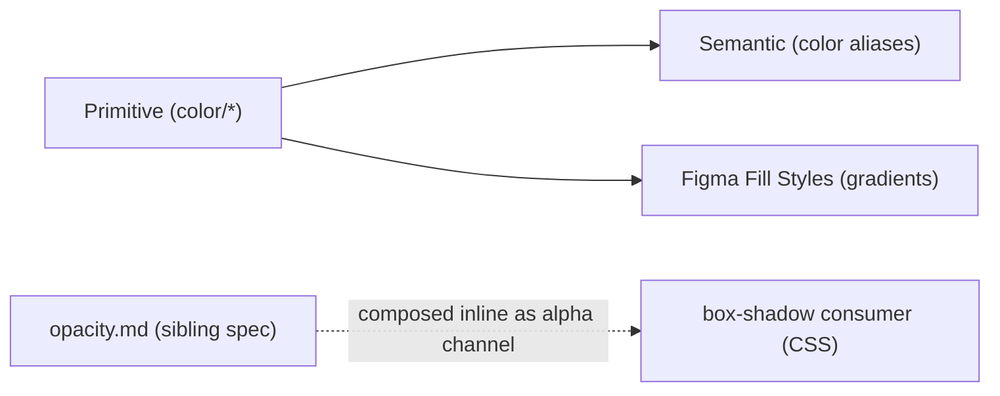

# Colors

## Figma source

- Canonical design-system Figma (Web-ODS-Theme — Design System & tokens): https://www.figma.com/design/Nshd9ukxIzpeUnzOXiWxUP/Web-ODS-Theme

## Summary

Color foundation in **three layers**:

1. **Primitive** — 33 base color primitives (Primary, Secondary, Entension, Functional, Neutral) + 8 functional `*-muted` / `*-subtle` primitives = 41 color primitives total. CSS exposes them under the project's flat `--color-*` namespace (matches existing `_colors.scss` Layer 1 raw-palette shape; drop the spec's `ds-` prefix per `code-conventions.mdc` § 4). All single-value, no per-mode override.
2. **Semantic** — 55 role-keyed aliases (Background, Content, Border, Highlight, Signal, Disabled, Canvas, Shadow). Each is a Figma `Color` Variable of subtype "Alias" pointing at a primitive. CSS surfaces them under `--color-<role>-<modifier>` matching the existing pattern in `_tokens.scss` (drop the spec's `brand-` prefix).
3. **Fill Styles** — 2 gradients (`gradient/horizontal`, `gradient/vertical`) live in the Figma Fill Styles panel because Variables can't store gradient types; CSS exposes them via `--gradient-*` literal `linear-gradient(...)` strings.

Opacity scalars (`--opacity-*`) ship in `opacity.md`. `box-shadow` and other alpha-needing consumers compose `rgba(0, 0, 0, var(--opacity-N))` inline against opacity primitives from that spec; there is no `color/alpha/*` rgba primitive layer.

## Layered model



Counts at a glance:

- **41 color primitives** = 33 base colors + 8 functional `*-muted|*-subtle`
- **55 semantic aliases** (incl. 13 Greek-letter pass-throughs preserved verbatim — `bg/{alpha..delta}` + `highlight/{alpha..iota}-base`)
- **2 gradient Fill Styles** (NOT Variables)

## Token values

> **Figma type primer.** Color primitives are Figma `Color` Variables. Semantic aliases are `Color` Variables of subtype "Alias" — their value is a reference to a primitive, not a raw hex. Gradients are Figma Fill Styles, not Variables.

### Primitive — Primary palette (brand cores)

| Figma name | Figma type | Value | CSS custom property | Notes |
|---|---|---|---|---|
| `color/lifelock-slate-blue` | Color | `#00445a` | `--color-lifelock-slate-blue` | brand core (Figma Primary; replaces `lifelock-green`) |
| `color/harbor-blue` | Color | `#017a96` | `--color-harbor-blue` | brand accent (Figma Primary; replaces `ocean-teal`) |
| `color/ice-blue` | Color | `#d9e9ee` | `--color-ice-blue` | brand light (Figma Primary; replaces `mist-blue`) |
| `color/lifelock-green` | Color (compat) | `var(--color-lifelock-slate-blue)` | `--color-lifelock-green` | CSS-only alias — keep consumers compiling |
| `color/ocean-teal` | Color (compat) | `var(--color-harbor-blue)` | `--color-ocean-teal` | CSS-only alias |
| `color/mist-blue` | Color (compat) | `var(--color-ice-blue)` | `--color-mist-blue` | CSS-only alias |
| `color/sand` | Color | `#e8e1cf` | `--color-sand` | — |
| `color/ivory` | Color | `#fef9ee` | `--color-ivory` | warm off-white |
| `color/warm-stone` | Color | `#c6ae94` | `--color-warm-stone` | — |
| `color/white` | Color | `#ffffff` | `--color-white` | — |

### Primitive — Secondary palette

| Figma name | Figma type | Value | CSS custom property | Notes |
|---|---|---|---|---|
| `color/coral` | Color | `#cf4e57` | `--color-coral` | — |
| `color/off-black` | Color | `#161616` | `--color-off-black` | — |
| `color/cool-gray` | Color | `#e2e2e2` | `--color-cool-gray` | distinct from `neutral/10` |
| `color/soft-gray` | Color | `#fafafa` | `--color-soft-gray` | distinct from `neutral/5` |

### Primitive — Entension palette

> Namespace preserved verbatim from legacy. The legacy spelling `Entension` is the locked spec.

| Figma name | Figma type | Value | CSS custom property | Notes |
|---|---|---|---|---|
| `color/entension/indigo` | Color | `#4a5d73` | `--color-entension-indigo` | — |
| `color/entension/dusty-violet` | Color | `#8a6fa8` | `--color-entension-dusty-violet` | — |
| `color/entension/plum` | Color | `#6c4a5a` | `--color-entension-plum` | — |
| `color/entension/moss-green` | Color | `#6f8a63` | `--color-entension-moss-green` | — |
| `color/entension/burnt-orange` | Color | `#c36b3a` | `--color-entension-burnt-orange` | — |
| `color/entension/rose` | Color | `#c96f7c` | `--color-entension-rose` | — |
| `color/entension/slate-blue` | Color | `#607e95` | `--color-entension-slate-blue` | — |
| `color/entension/extension-gray` | Color | `#8c9a9a` | `--color-entension-extension-gray` | renamed from bare `gray` to disambiguate from `neutral/*` ramp |

### Primitive — Functional palette

Includes 4 base functional roles + 8 `*-muted` / `*-subtle` tints.

| Figma name | Figma type | Value | CSS custom property | Notes |
|---|---|---|---|---|
| `color/functional/critical` | Color | `#d40404` | `--color-functional-critical` | error / destructive |
| `color/functional/critical-muted` | Color | `#e77f7e` | `--color-functional-critical-muted` | tint for muted critical states |
| `color/functional/critical-subtle` | Color | `#f6e1e0` | `--color-functional-critical-subtle` | tint for subtle critical backgrounds |
| `color/functional/attention` | Color | `#e07100` | `--color-functional-attention` | warning |
| `color/functional/attention-muted` | Color | `#edb57c` | `--color-functional-attention-muted` | — |
| `color/functional/attention-subtle` | Color | `#f7ece0` | `--color-functional-attention-subtle` | — |
| `color/functional/success` | Color | `#16a761` | `--color-functional-success` | — |
| `color/functional/success-muted` | Color | `#88d1ad` | `--color-functional-success-muted` | — |
| `color/functional/success-subtle` | Color | `#e3f2ea` | `--color-functional-success-subtle` | — |
| `color/functional/info` | Color | `#0f71f0` | `--color-functional-info` | — |
| `color/functional/info-muted` | Color | `#85b6f4` | `--color-functional-info-muted` | — |
| `color/functional/info-subtle` | Color | `#e3ecf8` | `--color-functional-info-subtle` | — |

### Primitive — Neutral

| Figma name | Figma type | Value | CSS custom property | Notes |
|---|---|---|---|---|
| `color/neutral/5` | Color | `#f8f8f7` | `--color-neutral-5` | distinct from `soft-gray` |
| `color/neutral/10` | Color | `#e3e3e2` | `--color-neutral-10` | distinct from `cool-gray` |
| `color/neutral/20` | Color | `#cdcccb` | `--color-neutral-20` | — |
| `color/neutral/30` | Color | `#b6b6b5` | `--color-neutral-30` | — |
| `color/neutral/40` | Color | `#a09f9e` | `--color-neutral-40` | — |
| `color/neutral/50` | Color | `#888887` | `--color-neutral-50` | — |
| `color/neutral/60` | Color | `#717171` | `--color-neutral-60` | — |
| `color/neutral/70` | Color | `#5b5a5a` | `--color-neutral-70` | — |
| `color/neutral/80` | Color | `#444444` | `--color-neutral-80` | — |
| `color/neutral/90` | Color | `#2e2d2d` | `--color-neutral-90` | — |

### Semantic — Background

| Figma name | Figma type | CSS custom property | Aliases to | Notes |
|---|---|---|---|---|
| `color/bg/default` | Color (alias) | `--color-bg-default` | `color/white` | — |
| `color/bg/subtle` | Color (alias) | `--color-bg-subtle` | `color/neutral/5` | shares hex with `canvas/subtle` (different role) |
| `color/bg/muted` | Color (alias) | `--color-bg-muted` | `color/neutral/10` | — |
| `color/bg/brand` | Color (alias) | `--color-bg-brand` | `color/lifelock-slate-blue` | Figma `#00445a` |
| `color/bg/brand-soft` | Color (alias) | `--color-bg-brand-soft` | `color/sand` | not actually brand-tinted; preserved verbatim |
| `color/bg/accent` | Color (alias) | `--color-bg-accent` | `color/ivory` | — |
| `color/bg/alpha` | Color (alias) | `--color-bg-alpha` | `color/warm-stone` | Greek pass-through; preserved verbatim |
| `color/bg/beta` | Color (alias) | `--color-bg-beta` | `color/cool-gray` | Greek pass-through; preserved verbatim |
| `color/bg/gamma` | Color (alias) | `--color-bg-gamma` | `color/soft-gray` | Greek pass-through; preserved verbatim |
| `color/bg/delta` | Color (alias) | `--color-bg-delta` | `color/neutral/20` | Greek pass-through; preserved verbatim |
| `color/bg/inverse` | Color (alias) | `--color-bg-inverse` | `color/off-black` | Figma `Background/inverse-primary` `#161616` |
| `color/bg/inverse-strong` | Color (alias) | `--color-bg-inverse-strong` | `color/off-black` | — |

### Semantic — Content

| Figma name | Figma type | CSS custom property | Aliases to | Notes |
|---|---|---|---|---|
| `color/text/primary` | Color (alias) | `--color-text-primary` | `color/lifelock-slate-blue` | Figma Content/primary |
| `color/text/secondary` | Color (alias) | `--color-text-secondary` | `color/off-black` | — |
| `color/text/brand` | Color (alias) | `--color-text-brand` | `color/harbor-blue` | Figma Content/brand |
| `color/text/accent` | Color (alias) | `--color-text-accent` | `color/entension/slate-blue` | Figma Content/accent `#607e95` |
| `color/text/inverse` | Color (alias) | `--color-text-inverse` | `color/white` | — |

### Semantic — Border

| Figma name | Figma type | CSS custom property | Aliases to | Notes |
|---|---|---|---|---|
| `color/border/strong` | Color (alias) | `--color-border-strong` | `color/lifelock-slate-blue` | Figma Border/primary |
| `color/border/strong-alt` | Color (alias) | `--color-border-strong-alt` | `color/off-black` | — |
| `color/border/subtle` | Color (alias) | `--color-border-subtle` | `color/neutral/10` | shares hex with `shadow/default` (different role) |
| `color/border/inverse` | Color (alias) | `--color-border-inverse` | `color/white` | — |
| `color/border/brand` | Color (alias) | `--color-border-brand` | `color/harbor-blue` | Figma Border/brand |
| `color/border/accent` | Color (alias) | `--color-border-accent` | `color/coral` | — |
| `color/border/focus` | Color (alias) | `--color-border-focus` | `color/harbor-blue` | focus-indicator trio |

### Semantic — Highlight

| Figma name | Figma type | CSS custom property | Aliases to | Notes |
|---|---|---|---|---|
| `color/highlight/brand` | Color (alias) | `--color-highlight-brand` | `color/lifelock-slate-blue` | Figma Highlight/brand |
| `color/highlight/brand-light` | Color (alias) | `--color-highlight-brand-light` | `color/ice-blue` | Figma `#d9e9ee` |
| `color/highlight/accent` | Color (alias) | `--color-highlight-accent` | `color/harbor-blue` | Figma Highlight/accent-base |
| `color/highlight/alpha-base` | Color (alias) | `--color-highlight-alpha-base` | `color/coral` | Greek pass-through; preserved verbatim |
| `color/highlight/beta-base` | Color (alias) | `--color-highlight-beta-base` | `color/entension/indigo` | Greek pass-through; preserved verbatim |
| `color/highlight/gamma-base` | Color (alias) | `--color-highlight-gamma-base` | `color/entension/dusty-violet` | Greek pass-through; preserved verbatim |
| `color/highlight/delta-base` | Color (alias) | `--color-highlight-delta-base` | `color/entension/plum` | Greek pass-through; preserved verbatim |
| `color/highlight/epsilon-base` | Color (alias) | `--color-highlight-epsilon-base` | `color/entension/moss-green` | Greek pass-through; preserved verbatim |
| `color/highlight/zeta-base` | Color (alias) | `--color-highlight-zeta-base` | `color/entension/burnt-orange` | Greek pass-through; preserved verbatim |
| `color/highlight/eta-base` | Color (alias) | `--color-highlight-eta-base` | `color/entension/rose` | Greek pass-through; preserved verbatim |
| `color/highlight/theta-base` | Color (alias) | `--color-highlight-theta-base` | `color/entension/slate-blue` | Greek pass-through; preserved verbatim |
| `color/highlight/iota-base` | Color (alias) | `--color-highlight-iota-base` | `color/entension/extension-gray` | Greek pass-through; preserved verbatim |

### Semantic — Signal

| Figma name | Figma type | CSS custom property | Aliases to | Notes |
|---|---|---|---|---|
| `color/signal/critical` | Color (alias) | `--color-signal-critical` | `color/functional/critical` | — |
| `color/signal/critical-muted` | Color (alias) | `--color-signal-critical-muted` | `color/functional/critical-muted` | — |
| `color/signal/critical-subtle` | Color (alias) | `--color-signal-critical-subtle` | `color/functional/critical-subtle` | — |
| `color/signal/warning` | Color (alias) | `--color-signal-warning` | `color/functional/attention` | `warning` ↔ `attention` name mismatch preserved verbatim |
| `color/signal/warning-muted` | Color (alias) | `--color-signal-warning-muted` | `color/functional/attention-muted` | — |
| `color/signal/warning-subtle` | Color (alias) | `--color-signal-warning-subtle` | `color/functional/attention-subtle` | — |
| `color/signal/success` | Color (alias) | `--color-signal-success` | `color/functional/success` | — |
| `color/signal/success-muted` | Color (alias) | `--color-signal-success-muted` | `color/functional/success-muted` | — |
| `color/signal/success-subtle` | Color (alias) | `--color-signal-success-subtle` | `color/functional/success-subtle` | — |
| `color/signal/info` | Color (alias) | `--color-signal-info` | `color/functional/info` | — |
| `color/signal/info-muted` | Color (alias) | `--color-signal-info-muted` | `color/functional/info-muted` | — |
| `color/signal/info-subtle` | Color (alias) | `--color-signal-info-subtle` | `color/functional/info-subtle` | — |

### Semantic — Disabled

| Figma name | Figma type | CSS custom property | Aliases to | Notes |
|---|---|---|---|---|
| `color/disabled/text` | Color (alias) | `--color-disabled-text` | `color/neutral/50` | shared across base / CTA / Input — text-on-disabled is consistent |
| `color/disabled/border` | Color (alias) | `--color-disabled-border` | `color/neutral/30` | shared across base / CTA / Input — border-on-disabled is consistent |
| `color/disabled/bg` | Color (alias) | `--color-disabled-bg` | `color/neutral/20` | system default; CTA and Input extensions intentionally re-target to lighter primitives (`--color-bg-cta-disabled → neutral-10`, `--color-bg-input-disabled → soft-gray`) for per-component visual weight — see design decision 13 below and the CTA / Input extension tables |

### Semantic — Canvas

| Figma name | Figma type | CSS custom property | Aliases to | Notes |
|---|---|---|---|---|
| `color/canvas/default` | Color (alias) | `--color-canvas-default` | `color/white` | hex shared with `bg/default` (different role) |
| `color/canvas/subtle` | Color (alias) | `--color-canvas-subtle` | `color/neutral/5` | hex shared with `bg/subtle` (different role) |
| `color/canvas/contrast` | Color (alias) | `--color-canvas-contrast` | `color/soft-gray` | — |

### Semantic — Shadow

| Figma name | Figma type | CSS custom property | Aliases to | Notes |
|---|---|---|---|---|
| `color/shadow/default` | Color (alias) | `--color-shadow-default` | `color/neutral/10` | retained for legacy compat; new shadow consumers compose `rgba(0, 0, 0, var(--opacity-N))` inline |

### Semantic — Web-ODS compat aliases (CSS-only)

A flat compat layer published at the bottom of [`_colors.scss`](./_colors.scss) (lines 254–269). These names mirror the Web-ODS multi-brand semantic vocabulary (`--color-content-*` / `--color-background-*` / `--color-border-{primary,secondary,tertiary}`) so the shared Design System gallery stories (`colors.stories.js`, `typography.stories.js`, `borders.stories.js`, …) can render gallery chrome — page background, body text, divider lines — without forking per package. Each alias resolves to a canonical LifeLock semantic above. **Not published as Figma Variables** — the upstream Figma file ships only the LifeLock canonical names.

| Figma name | Figma type | CSS custom property | Aliases to | Notes |
|---|---|---|---|---|
| — | Color (CSS-only alias) | `--color-content-primary` | `--color-text-primary` | Web-ODS gallery-chrome compat |
| — | Color (CSS-only alias) | `--color-content-secondary` | `--color-text-secondary` | Web-ODS gallery-chrome compat |
| — | Color (CSS-only alias) | `--color-content-brand` | `--color-text-brand` | Web-ODS gallery-chrome compat |
| — | Color (CSS-only alias) | `--color-content-accent` | `--color-text-accent` | Web-ODS gallery-chrome compat |
| — | Color (CSS-only alias) | `--color-content-inverse-primary` | `--color-text-inverse` | Web-ODS gallery-chrome compat |
| — | Color (CSS-only alias) | `--color-background-primary` | `--color-bg-default` | Web-ODS gallery-chrome compat; also consumed by `slider.scss` (existing component) |
| — | Color (CSS-only alias) | `--color-background-secondary` | `--color-bg-subtle` | Web-ODS gallery-chrome compat |
| — | Color (CSS-only alias) | `--color-background-tertiary` | `--color-bg-muted` | Web-ODS gallery-chrome compat |
| — | Color (CSS-only alias) | `--color-background-brand` | `--color-bg-brand` | Web-ODS gallery-chrome compat |
| — | Color (CSS-only alias) | `--color-background-brand-lighter` | `--color-bg-brand-soft` | Web-ODS gallery-chrome compat |
| — | Color (CSS-only alias) | `--color-background-accent` | `--color-bg-accent` | Web-ODS gallery-chrome compat |
| — | Color (CSS-only alias) | `--color-border-primary` | `--color-border-strong` | Web-ODS gallery-chrome compat |
| — | Color (CSS-only alias) | `--color-border-secondary` | `--color-border-strong-alt` | Web-ODS gallery-chrome compat |
| — | Color (CSS-only alias) | `--color-border-tertiary` | `--color-border-subtle` | Web-ODS gallery-chrome compat; also consumed by `slider.scss` (existing component) |

New LifeLock component code SHOULD consume the canonical LifeLock semantic names (`--color-bg-default`, `--color-text-primary`, `--color-border-subtle`, …) rather than this compat layer. The two pre-existing slider references are preserved verbatim; a future cleanup could migrate them to the canonical names and let the compat layer return to gallery-only use.

### Fill Styles — Gradients (NOT Variables)

> Figma Variables only support `Color | Number | String | Boolean`; multi-stop gradients can't be expressed as a single value of any of those types. Gradients live in the Figma **Fill Styles** panel; CSS exposes them as literal `linear-gradient(...)` strings under `--gradient-*`. Each stop's color binds to a Color primitive where one matches.

| Figma name | Figma type | CSS custom property | Notes |
|---|---|---|---|
| `gradient/horizontal` | Fill Style (linear-gradient) | `--gradient-horizontal` | each stop binds to a Color primitive where one matches |
| `gradient/vertical` | Fill Style (linear-gradient) | `--gradient-vertical` | same approach |

## CSS implementation pattern

```css
:root {
  /* Primitive — Primary palette */
  --color-lifelock-slate-blue: #00445a;
  --color-harbor-blue: #017a96;
  --color-ice-blue: #d9e9ee;
  --color-lifelock-green: var(--color-lifelock-slate-blue); /* compat */
  --color-ocean-teal: var(--color-harbor-blue); /* compat */
  --color-mist-blue: #cce5e7;
  /* ... 4 more ... */

  /* Primitive — Secondary, Functional, Neutral palettes */
  /* ... */

  /* Primitive — Entension palette (verbatim from legacy) */
  --color-entension-indigo: #4a5d73;
  --color-entension-dusty-violet: #8a6fa8;
  /* ... 6 more ... */

  /* Semantic — Background, Content, Border, Highlight, Signal, Disabled, Canvas, Shadow */
  --color-bg-default: var(--color-white);
  --color-text-primary: var(--color-lifelock-slate-blue);
  --color-border-focus: var(--color-harbor-blue);
  --color-signal-warning: var(--color-functional-attention);
  --color-bg-alpha: var(--color-warm-stone);
  --color-highlight-iota-base: var(--color-entension-extension-gray);
  /* ... ~52 more ... */

  /* Gradients (literal strings; Designer reads stops from legacy file) */
  --gradient-horizontal: linear-gradient(90deg, /* stops */);
  --gradient-vertical:   linear-gradient(180deg, /* stops */);
}

/* Inline rgba composition for box-shadow consumers — `--opacity-10` ships in opacity.md */
.elevated { box-shadow: 0 2px 8px rgba(0, 0, 0, var(--opacity-10)); }
```

Single theme — no per-mode overrides. No `@media` rules apply to color tokens.

## Design decisions

1. **Entension namespace preserved verbatim** — new variables live at `color/entension/<name>`; CSS `--color-entension-*`. The earlier typo-rename proposal (`Entension` → `Extension`) is rejected; the legacy spelling is the single source of truth.
2. **`entension/gray` → `entension/extension-gray` rename** — the only deviation inside the Entension palette, made to prevent name collision with the neutral ramp.
3. **13 Greek-letter pass-through aliases preserved** — `bg/{alpha..delta}` + `highlight/{alpha..iota}-base` are rebuilt 1:1 from legacy. Each wraps a primitive without adding role information; consumers may reach for either the alias or the primitive directly.
4. **`cool-gray` (`#e2e2e2`) and `neutral/10` (`#e3e3e2`) coexist** — off-by-1 hex preserved verbatim. Names carry distinct palette intent (Secondary vs. Neutral); collapsing them would erase that distinction.
5. **`soft-gray` (`#fafafa`) and `neutral/5` (`#f8f8f7`) coexist** — same rationale.
6. **5 label-vs-variable drift rows resolved to the Variable value** — the legacy spec frame had visible hand-typed hex labels that disagreed with the underlying Figma Variable on 5 swatches: `ocean-teal #108389` (label `#108399`), `warm-stone #c6ae94` (label `#c8ae94`), `dusty-violet #8a6fa8` (label `#8a8fa8`), `success #16a761` (label `#16a701`), `neutral-90 #2e2d2d` (label `#2e2d20`). The Figma Variables panel is canonical; visible spec-frame labels are ignored.
7. **`bg/brand-soft = sand` preserved** — value is `sand` (`#e8e1cf`), not actually brand-tinted toward `lifelock-green`. The role name documents the legacy decision rather than driving an intent-based re-targeting.
8. **`bg/inverse` follows Figma `Background/inverse-primary` (`off-black`)** — previously mid-tone `ocean-teal`; remapped 2026-07-31 from live LifeLock Semantic Colours variables.
9. **`Signal/warning → functional/attention` name mismatch preserved** — the semantic role is named `warning` while the underlying functional primitive is named `attention`. The alias chain `--color-signal-warning → --color-functional-attention` is explicit and intentional.
10. **Color + opacity layering, no rgba primitives** — `box-shadow` and other consumers needing alpha compose `rgba(0, 0, 0, var(--opacity-N))` inline at the call site, where `--opacity-N` resolves to a primitive defined in `opacity.md`. There is no `color/alpha/*` rgba primitive layer.
11. **Gradients as Figma Fill Styles** — Figma Variables only support `Color | Number | String | Boolean`; gradients can't be expressed as a single value of any of those. Each gradient is a named Fill Style; CSS exposes the literal `linear-gradient(...)` string.
12. **Hex collisions across roles are intentional** — `bg/default ≡ canvas/default` (white), `bg/subtle ≡ canvas/subtle` (`neutral/5`), `border/subtle ≡ shadow/default` (`neutral/10`). Different roles, same value; preserving both names lets future per-role re-targeting stay cheap.
13. **Disabled-bg fragments by component, intentionally.** Three "disabled background" tokens coexist, each tuned to its host component's visual weight: `--color-disabled-bg → neutral-20` (`#cdcccb`, system default — used by generic disabled chrome), `--color-bg-cta-disabled → neutral-10` (`#e3e3e2`, lighter — buttons need more depth at rest), `--color-bg-input-disabled → soft-gray` (`#fafafa`, near-white — inputs almost vanish when disabled). The text and border halves of the disabled story do **not** fragment — both CTA and Input alias straight back to `--color-disabled-text` and `--color-disabled-border`. If a future component family needs its own disabled-bg, add a fourth token in that family's extension; do not collapse these three.

## Cross-spec dependencies

- Self-contained for color tokens. Three layers (color primitives + semantic aliases + gradient Fill Styles) live in this spec.
- **Sibling — opacity scalars:** opacity primitives (`--opacity-*`) ship in `opacity.md`. The two specs are independent: a consumer needing both pulls `--color-*` from this spec and `--opacity-*` from `opacity.md` and composes them at the call site.

## Extension: CTA color aliases

Adds **25 semantic CTA aliases** to the existing Color Semantic collection. **No new primitives** — every CTA alias resolves to an existing color primitive.

### Why

Surfacing CTA-specific bindings as semantic aliases (`--color-bg-cta-*`, `--color-text-on-cta-*`, `--color-border-cta-*`, `--color-fg-progress-*`) keeps component CSS readable, consolidates the variant × state matrix for any future CTA-shaped component (link, tag-chip, toggle), and centralizes the 5-variant × 3-state hex resolution in one place.

### Token values

| CSS custom property | Resolves to (primitive) | Variant | Slot | Hex |
|---|---|---|---|---|
| `--color-bg-cta-primary-default` | `--color-lifelock-green` | primary | bg / default | `#00445a` (via slate-blue alias) |
| `--color-bg-cta-primary-hover` | `--color-off-black` | primary | bg / hover | `#161616` |
| `--color-bg-cta-primary-pressed` | `--color-ocean-teal` | primary | bg / pressed | `#017a96` (via harbor-blue alias) |
| `--color-bg-cta-secondary-default` | `--color-neutral-5` | secondary | bg / default | `#f8f8f7` |
| `--color-bg-cta-secondary-hover` | `--color-mist-blue` | secondary | bg / hover | `#cce5e7` |
| `--color-bg-cta-secondary-pressed` | `--color-cool-gray` | secondary | bg / pressed | `#e2e2e2` |
| `--color-bg-cta-tertiary-default` | `--color-sand` | tertiary | bg / default | `#e8e1cf` |
| `--color-bg-cta-tertiary-hover` | `--color-warm-stone` | tertiary | bg / hover | `#c6ae94` |
| `--color-bg-cta-tertiary-pressed` | `--color-ivory` | tertiary | bg / pressed | `#fef9ee` |
| `--color-bg-cta-inverse-default` | `--color-ocean-teal` | inverse | bg / default | `#017a96` (via harbor-blue alias) |
| `--color-bg-cta-inverse-hover` | `--color-lifelock-green` | inverse | bg / hover | `#00445a` (via slate-blue alias) |
| `--color-bg-cta-inverse-pressed` | `--color-off-black` | inverse | bg / pressed | `#161616` |
| `--color-bg-cta-text-hover` | `--color-neutral-5` | text | bg / hover | `#f8f8f7` |
| `--color-bg-cta-text-pressed` | `--color-neutral-10` | text | bg / pressed | `#e3e3e2` |
| `--color-bg-cta-disabled` | `--color-neutral-10` | universal | bg / disabled | `#e3e3e2` |
| `--color-text-on-cta-primary` | `--color-white` | primary | foreground | `#ffffff` |
| `--color-text-on-cta-secondary` | `--color-lifelock-green` | secondary | foreground | `#00445a` |
| `--color-text-on-cta-tertiary` | `--color-lifelock-green` | tertiary | foreground | `#00445a` |
| `--color-text-on-cta-inverse` | `--color-white` | inverse | foreground | `#ffffff` |
| `--color-text-on-cta-text` | `--color-lifelock-green` | text | foreground | `#00445a` |
| `--color-text-on-cta-disabled` | `--color-neutral-50` | universal | foreground | `#888887` |
| `--color-border-cta-secondary` | `--color-lifelock-green` | secondary | border | `#00445a` |
| `--color-border-cta-disabled` | `--color-neutral-30` | universal | border | `#b6b6b5` |
| `--color-fg-progress-track` | `--color-neutral-30` | universal | spinner-track | `#b6b6b5` |
| `--color-fg-progress-fill` | `--color-lifelock-green` | universal | spinner-sweep | `#00445a` |

### Locked decisions

1. **`pressed` state name verbatim from legacy stickersheet** — the State axis uses `pressed`, not `active`. Code layer still uses `:active` pseudo-class (Figma vocabulary diverges from CSS pseudo-class vocabulary intentionally).
2. **No new primitives** — every CTA alias resolves to an existing color primitive.
3. **Text variant has no `bg-default` alias** — the `text` button variant is transparent at default state. Only `--color-bg-cta-text-hover` and `--color-bg-cta-text-pressed` ship.
4. **`disabled` is universal across variants** — `--color-bg-cta-disabled`, `--color-border-cta-disabled`, `--color-text-on-cta-disabled` apply to all 5 button variants.
5. **Progress / spinner aliases use `fg-progress` namespace** — `--color-fg-progress-track` + `--color-fg-progress-fill` reserved for spinner / progress UI.

## Extension: Input color aliases

Adds **14 semantic input-family aliases** to the existing Color Semantic collection — 11 input-chrome aliases (bg / border / placeholder) plus 3 generic text-color aliases (default / disabled / error). **No new primitives** — every alias resolves to a primitive that already ships in the Primary / Secondary / Functional / Neutral palettes (or to an existing semantic alias).

### Why

The `base-input` rebuild (and its specializing consumers — `text-input`, `password`, `search-box`, `picker`, `code-input`, `form-field`, `search-bar`) consume an input-family chrome contract: background, default / hover / focus / focus-glow / error / error-glow / disabled / divider borders, plus a placeholder text color. Surfacing these as named aliases keeps consumer CSS readable and lets a designer re-target the entire input chrome by editing 11 alias bindings.

### Token values

| CSS custom property | Resolves to | Slot | Hex | Notes |
|---|---|---|---|---|
| `--color-bg-input` | `--color-white` | bg / default | `#ffffff` | Same primitive as `--color-bg-default`; named separately so a future input-only re-target doesn't ripple into surfaces. |
| `--color-bg-input-disabled` | `--color-soft-gray` | bg / disabled | `#fafafa` | Subtle gray. Distinct from `--color-disabled-bg` because input disabled is a softer treatment. |
| `--color-border-input-default` | `--color-neutral-30` | border / default | `#b6b6b5` | Mid-neutral border — visible at rest, recedes against page chrome. |
| `--color-border-input-hover` | `--color-neutral-50` | border / hover | `#888887` | One step darker than default. |
| `--color-border-input-focus` | `var(--color-border-focus)` | border / focus | `#017a96` | Alias chain → `color/harbor-blue`. Reuses the system-wide focus border. |
| `--color-border-input-focus-glow` | `color-mix(in srgb, var(--color-border-focus) 24%, transparent)` | box-shadow / focus glow | `rgba(16, 131, 137, 0.24)` | Composes the 24% alpha glow inline via `color-mix` so the glow auto-tracks any re-target of `--color-border-focus`. No new primitive needed. |
| `--color-border-input-error` | `var(--color-signal-critical)` | border / error | `#d40404` | Alias chain → `color/functional/critical`. |
| `--color-border-input-error-glow` | `var(--color-signal-critical-subtle)` | box-shadow / error glow | `var(--color-functional-critical-subtle)` | Softer red-tint for the error focus-glow. |
| `--color-border-input-disabled` | `var(--color-disabled-border)` | border / disabled | `#b6b6b5` | Alias chain → `color/neutral/30`. |
| `--color-border-input-divider` | `--color-neutral-20` | divider / default | `#cdcccb` | Used by `base-input`'s optional `--leading-divider` / `--trailing-divider` modifiers. |
| `--color-text-placeholder` | `var(--color-disabled-text)` | text / placeholder | `#888887` | Alias chain → `color/neutral/50`. |
| `--color-text-default` | `var(--color-text-secondary)` | text / default body | `#161616` | Alias chain → `color/off-black`. Generic-purpose default body / input-value / label text. |
| `--color-text-disabled` | `var(--color-disabled-text)` | text / disabled | `#888887` | Re-named alias of the existing `disabled/text`. |
| `--color-text-error` | `var(--color-signal-critical)` | text / error | `#d40404` | Same red as `signal/critical` so error-text reads consistently. |

### Locked decisions

1. **No new primitives** — every input-family alias resolves to an existing primitive or to an existing semantic alias.
2. **Some aliases share a primitive with existing aliases by design** — e.g. `--color-bg-input` and `--color-bg-default` both resolve to `--color-white`. Distinct semantic names let one role re-target without disturbing the other.
3. **Focus glow composes alpha inline via `color-mix`** — `--color-border-input-focus-glow` resolves to `color-mix(in srgb, var(--color-border-focus) 24%, transparent)` rather than a new tinted primitive or an `-rgb` tuple. Matches the project's existing `color-mix(in srgb, …)` usage for synthesizing functional bases in `_colors.scss`; the glow auto-tracks any future re-target of `--color-border-focus`. Browser support: Chromium 111+ / Firefox 113+ / Safari 16.2+ (covered by the project's modern-browser baseline).
4. **Error glow uses an existing tinted primitive** — `--color-border-input-error-glow` resolves to `--color-signal-critical-subtle` (the muted red ramp).
5. **Divider value chosen for subtlety** — `--color-border-input-divider` resolves to `--color-neutral-20` (one step lighter than the default input border at `neutral-30`).
6. **`text-{default,disabled,error}` are alias-of-existing semantic aliases** — named in the un-prefixed `text-*` namespace because they're useful beyond the input family. The `text-secondary` / `disabled-text` / `signal-critical` aliases they wrap **stay** — these are additions, not renames.
