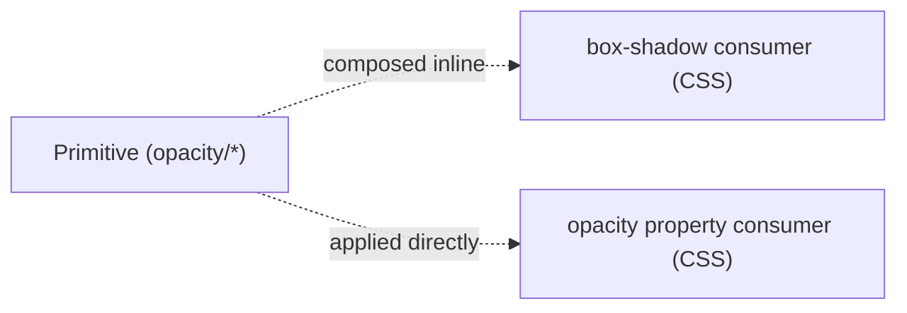

# Opacity

## Figma source

- Canonical Foundations table (Web-ODS-Theme — Opacity): https://www.figma.com/design/Nshd9ukxIzpeUnzOXiWxUP/Web-ODS-Theme?node-id=18014-753&m=dev

## Summary

Opacity foundation as a primitive layer only — 13 opacity scalars (`opacity/{0,5,10,20,25,30,40,50,60,70,75,80,90}`) typed as Figma `Number` Variables with display format `PERCENT`. CSS exposes them as `--opacity-N`, mirrored verbatim in the sibling [`_opacity.scss`](./_opacity.scss). No semantic alias layer: the project pattern is **color + opacity layering**, where consumers compose `rgba(0, 0, 0, var(--opacity-N))` inline at the call site (or apply a separate `opacity` property where the host CSS allows it). There is no `color/alpha/*` rgba primitive layer anywhere in the design system.

The Figma variable group/name shape is **normalized away from the legacy two-segment shape `Opacity/Opacity-N`** (capital `O`, redundant `Opacity-` prefix) to a clean one-segment lowercase `opacity/N`.

## Layered model



Counts at a glance:

- **13 primitives** (single value each, no per-mode override)
- **0 semantic aliases** (project pattern: inline composition at the consumer)

## Token values

> **Figma type primer.** Each opacity primitive is a Figma `Number` Variable with display format `PERCENT`. The underlying stored value is a **decimal** (e.g. `0.05`); designers see `5%` in the Variables panel; CSS expresses the value as a literal percentage to match the project's existing `--opacity-N` shape.

### Primitive — Opacity scalars (13, namespace `opacity/*`)

| Figma name | Figma type | Value | CSS custom property | Notes |
|---|---|---|---|---|
| `opacity/0` | Number (Percent) | `0` (= 0%) | `--opacity-0` | — |
| `opacity/5` | Number (Percent) | `0.05` (= 5%) | `--opacity-5` | — |
| `opacity/10` | Number (Percent) | `0.1` (= 10%) | `--opacity-10` | consumed by shadow inline rgba (`rgba(0, 0, 0, var(--opacity-10))`) |
| `opacity/20` | Number (Percent) | `0.2` (= 20%) | `--opacity-20` | — |
| `opacity/25` | Number (Percent) | `0.25` (= 25%) | `--opacity-25` | quartile mixed into decadal scale |
| `opacity/30` | Number (Percent) | `0.3` (= 30%) | `--opacity-30` | — |
| `opacity/40` | Number (Percent) | `0.4` (= 40%) | `--opacity-40` | — |
| `opacity/50` | Number (Percent) | `0.5` (= 50%) | `--opacity-50` | — |
| `opacity/60` | Number (Percent) | `0.6` (= 60%) | `--opacity-60` | — |
| `opacity/70` | Number (Percent) | `0.7` (= 70%) | `--opacity-70` | — |
| `opacity/75` | Number (Percent) | `0.75` (= 75%) | `--opacity-75` | quartile mixed into decadal scale |
| `opacity/80` | Number (Percent) | `0.8` (= 80%) | `--opacity-80` | — |
| `opacity/90` | Number (Percent) | `0.9` (= 90%) | `--opacity-90` | — |

**Deferred** (open as separate tickets when a component asks):

- `opacity/15`, `opacity/35`, `opacity/45`, `opacity/55`, `opacity/65`, `opacity/85`, `opacity/95` — gap-fills for the decadal ramp. Not present in legacy.
- `opacity/100` — opaque endpoint; CSS default `opacity` is `1`, and the most common case is to omit the property entirely. Token would be redundant. Not present in legacy.

## CSS implementation pattern

```css
:root {
  --opacity-0:  0%;
  --opacity-5:  5%;
  --opacity-10: 10%;
  --opacity-20: 20%;
  --opacity-25: 25%;
  --opacity-30: 30%;
  --opacity-40: 40%;
  --opacity-50: 50%;
  --opacity-60: 60%;
  --opacity-70: 70%;
  --opacity-75: 75%;
  --opacity-80: 80%;
  --opacity-90: 90%;
}

/* Consumption pattern A: applied directly to the CSS opacity property */
.muted-state { opacity: var(--opacity-50); }

/* Consumption pattern B: composed inline as the alpha channel of rgba() */
.elevated  { box-shadow: 0 2px 8px rgba(0, 0, 0, var(--opacity-10)); }
.scrim     { background: rgba(0, 0, 0, var(--opacity-50)); }
```

Canonical source on disk: `themes/default/_opacity.scss` (re-exported by `src/tokens/opacity/_opacity.scss`). Single theme — no per-mode overrides.

## Design decisions

1. **Stored as `Number (Percent)` in Figma; emitted as `%` in CSS** — the Figma Variable subtype is `Number` with display format `PERCENT`; the underlying stored value is a decimal (`0.05`); designers see `5%` in the Variables panel. CSS uses the project's percent-literal style (`5%`) to match `_tokens.scss`.
2. **Quartile steps `25` and `75` mixed into a decadal scale preserved verbatim** — legacy interleaves `25 / 75` into an otherwise-decadal `0 / 5 / 10 / 20 / 30 / 40 / 50 / 60 / 70 / 80 / 90` ramp. Removing the quartiles would break any consumer already referencing them.
3. **`opacity/100` opaque endpoint dropped** — CSS default `opacity` is `1`; the most common "fully opaque" case is to omit the property entirely. A token for the opaque endpoint would be redundant for the most common case.
4. **No `color/alpha/*` rgba primitive layer** — the project pattern is **color + opacity layering**, not pre-mixed rgba primitives. `box-shadow` consumers compose rgba inline at the call site: `rgba(0, 0, 0, var(--opacity-N))`. This decision is shared with `colors.md` and `shadow.md`.
5. **No semantic alias layer** — opacity scalars don't carry role intent on their own; they're modulators applied to a base color or element. A `--opacity-disabled` style alias would just be a renamed primitive with no extra information.
6. **All tokens single-value** — no per-mode overrides anywhere.
7. **Figma variable group/name shape normalized: `Opacity/Opacity-N` → `opacity/N`** — legacy uses a two-segment shape with capital `O` and a redundant `Opacity-` prefix, plus internal inconsistency on the zero entry (variable name `Opacity-00` vs display label `Opacity-0`). Normalized to one-segment lowercase `opacity/N` because every other primitive group in the system is one-segment lowercase (`color/primary/<name>`, `radius/N`, `border-width/N`, `space/N`, `shadow/{x,y,blur,spread}/N`). The normalization automatically resolves the legacy zero-padding inconsistency.
