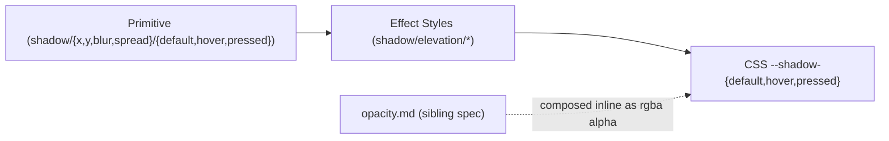

# Shadow

## Figma source

- Canonical Foundations table (Web-ODS-Theme — Shadow): https://www.figma.com/design/Nshd9ukxIzpeUnzOXiWxUP/Web-ODS-Theme?node-id=18014-754&m=dev

## Summary

Shadow foundation with **3 composite Shadow Effect Styles** (`shadow/elevation/{default,hover,pressed}`) plus state-keyed atom primitives (`shadow/{x,y,blur,spread}/{default,hover,pressed}`). CSS exposes the 3 composites as `--shadow-{default,hover,pressed}` and the per-dimension atoms as `--shadow-raw-{x,y,blur,spread}-{state}` — canonical in `themes/default/_shadow.scss` (re-exported by [`_shadow.scss`](./_shadow.scss)). Shadow color is composed as `rgb(0 0 0 / var(--opacity-10))` against opacity primitives; there is no `color/alpha/*` rgba primitive layer.

Single theme — every shadow has exactly one value, no per-mode override.

**Architectural decisions:**

1. **Shadow color = `rgba(0, 0, 0, var(--opacity-N))`** composed inline. No pre-mixed alpha primitives. Shadow consumers compose black + opacity at the call site, where `--opacity-N` is supplied by `opacity.md`. Visually approximates the legacy `#e3e3e2` opaque-gray shadow at ~10% black opacity.
2. **Composite shadow Effects live in the Figma Effect Styles panel**, not the Variables collection (parallel to Fill Styles for gradients and TextStyles for typography — Figma Variables only support Color / Number / String / Boolean primitives, not composite Effects).
3. **`default ≡ hover` collision preserved verbatim** — the design intent is that hover lift comes from a Y-translate on the element, not from a shadow change.
4. **State-keyed atom primitives** — the project ships one atom per (dimension × state) tuple even when the value duplicates across states. Matches `_tokens.scss` (12 atoms over 3 states), trades a small amount of duplication for one-token-per-binding clarity in Figma.

## Layered model



Counts at a glance:

- **12 atom Number primitives** — 4 dimensions (`x / y / blur / spread`) × 3 states (`default / hover / pressed`)
- **3 composite Effect Styles** — `shadow/elevation/{default,hover,pressed}`
- **3 composed CSS aliases** — `--shadow-{default,hover,pressed}`
- **0 rgba primitives** — shadow color composed inline at the consumer

## Token values

> **Figma type primer:** Atom primitives are stored as Figma **Number** Variables, one per `(dimension × state)` tuple. The 3 composite shadows are Figma **Effect Styles** (Effect Styles panel — *not* a Variable collection). Effect Styles are composite "looks" that bind atom Variables and a color value, parallel to the way Fill Styles work for gradients. CSS exposes the composite shadow as a single `--shadow-*` custom property whose value is the full `box-shadow` string.

### Atom primitives (Primitive collection — state-keyed)

| Figma name | Value | CSS custom property | Figma type |
|---|---|---|---|
| `shadow/x/default` | 0 | `--shadow-raw-x-default` | Number |
| `shadow/y/default` | 6 | `--shadow-raw-y-default` | Number |
| `shadow/blur/default` | 24 | `--shadow-raw-blur-default` | Number |
| `shadow/spread/default` | 0 | `--shadow-raw-spread-default` | Number |
| `shadow/x/hover` | 0 | `--shadow-raw-x-hover` | Number |
| `shadow/y/hover` | 6 | `--shadow-raw-y-hover` | Number |
| `shadow/blur/hover` | 24 | `--shadow-raw-blur-hover` | Number |
| `shadow/spread/hover` | 0 | `--shadow-raw-spread-hover` | Number |
| `shadow/x/pressed` | 0 | `--shadow-raw-x-pressed` | Number |
| `shadow/y/pressed` | 2 | `--shadow-raw-y-pressed` | Number |
| `shadow/blur/pressed` | 6 | `--shadow-raw-blur-pressed` | Number |
| `shadow/spread/pressed` | 0 | `--shadow-raw-spread-pressed` | Number |

That's 12 atom Number primitives total — one per `(dimension × state)` tuple. State-keyed naming matches `_tokens.scss` and keeps each Effect Style binding to its own primitives, even when values duplicate across states (e.g. `default` and `hover` Y / Blur are equal by design — see decision 3).

### Intentionally not in spec (referenced by legacy but not carried forward)

| Legacy Figma name | Why intentionally not in spec |
|---|---|
| `Color/Shadow/primary` (= `#e3e3e2` / `#e6e6e6`) | Replaced by inline `rgba(0, 0, 0, var(--opacity-10))` composition. |

### Composite shadow Effects (Figma Effect Styles panel — not a Variable collection)

| Figma name (Effect Style) | Value (X / Y / Blur / Spread / color) | CSS custom property | Figma type | Notes |
|---|---|---|---|---|
| `shadow/elevation/default` | 0 / 6 / 24 / 0 / `rgba(0, 0, 0, 10%)` | `--shadow-default` | Effect Style (drop-shadow) | Resting elevation. |
| `shadow/elevation/hover` | 0 / 6 / 24 / 0 / `rgba(0, 0, 0, 10%)` | `--shadow-hover` | Effect Style (drop-shadow) | Hover elevation. **Intentionally identical to `default`**. Lift comes from element-level Y-translate on the consumer. |
| `shadow/elevation/pressed` | 0 / 2 / 6 / 0 / `rgba(0, 0, 0, 10%)` | `--shadow-pressed` | Effect Style (drop-shadow) | Pressed elevation. Visibly tighter than `default` (smaller Y, smaller blur). |

## CSS implementation pattern

```css
:root {
  /* Atom primitives — one per (dimension × state). The 0-valued atoms stay
     unit-less; the px-valued atoms carry the `px` unit so var() substitutes
     cleanly inside box-shadow shorthand. */
  --shadow-raw-x-default:      0;
  --shadow-raw-y-default:      6px;
  --shadow-raw-blur-default:   24px;
  --shadow-raw-spread-default: 0;

  --shadow-raw-x-hover:      0;
  --shadow-raw-y-hover:      6px;
  --shadow-raw-blur-hover:   24px;
  --shadow-raw-spread-hover: 0;

  --shadow-raw-x-pressed:      0;
  --shadow-raw-y-pressed:      2px;
  --shadow-raw-blur-pressed:   6px;
  --shadow-raw-spread-pressed: 0;

  /* Composed shadows — color is inlined as rgba(0, 0, 0, opacity) per project
     pattern. No Color variable for shadow. Opacity primitive comes from
     opacity.md. */
  --shadow-default: 0 6px 24px 0 rgb(0 0 0 / var(--opacity-10));
  --shadow-hover:   0 6px 24px 0 rgb(0 0 0 / var(--opacity-10)); /* identical to default */
  --shadow-pressed: 0 2px 6px  0 rgb(0 0 0 / var(--opacity-10));
}
```

Concrete-value form (for visual reference):

```css
:root {
  --shadow-default: 0 6px 24px 0 rgba(0, 0, 0, 0.10);
  --shadow-hover:   0 6px 24px 0 rgba(0, 0, 0, 0.10);
  --shadow-pressed: 0 2px 6px  0 rgba(0, 0, 0, 0.10);
}
```

Consumer usage:

```css
.card {
  box-shadow: var(--shadow-default);
}
.card:hover {
  box-shadow: var(--shadow-hover);
  transform: translateY(-2px); /* the actual "lift" cue, since shadow is identical */
}
.card:active {
  box-shadow: var(--shadow-pressed);
}
```

## Design decisions

1. **`default ≡ hover` collision preserved verbatim** — `shadow/elevation/default` and `shadow/elevation/hover` have identical X / Y / Blur / Spread / color. Hover lift on a consumer element comes from a Y-translate (e.g. `transform: translateY(-2px)`) applied at the consumer's `:hover` state, NOT from a shadow change. The `--shadow-hover` token is retained as a separate semantic so any future stakeholder differentiation only requires changing the token, not every consumer.
2. **State-keyed atom primitives** — primitives ship one per `(dimension × state)` tuple even when values duplicate (e.g. `--shadow-raw-x-{default,hover,pressed}` are all `0`). Matches the project's existing `_tokens.scss` naming and lets each Effect Style bind to its own primitives without aliasing across states.
3. **Shadow color composed inline, no rgba primitives** — `box-shadow` consumers compose `rgba(0, 0, 0, var(--opacity-10))` inline at the call site, where `--opacity-10` is supplied by `opacity.md`. The legacy `Color/Shadow/primary` Color variable (= opaque hex `#e3e3e2`) is not carried forward; visually equivalent at ~10% black opacity on white. Project pattern locked across `colors.md`, `opacity.md`, and this spec.
4. **Legacy "Shadow (TBC)" frame title is informational only** — the legacy spec frame heading reads "Shadow (TBC)" (original designer marked it as To-Be-Confirmed) and the HEX value column on the rendered spec frame is empty. The Variable values themselves (X / Y / Blur / Spread / color) are well-defined and the Figma Effect renders correctly on the example squares; only the spec frame's documentation column was unfinished.

## Cross-spec dependencies

- Depends on `opacity.md` for `--opacity-10` (the opacity scalar used in the inline rgba composition).
- Independent of `colors.md` — does NOT consume any color primitive or any color semantic alias.
