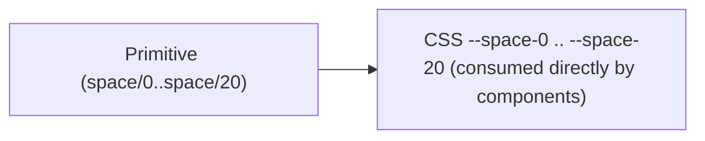

# Spacing

## Figma source

- Canonical Foundations table (Web-ODS-Theme — Spacing): https://www.figma.com/design/Nshd9ukxIzpeUnzOXiWxUP/Web-ODS-Theme?node-id=18014-755&m=dev

## Summary

The spacing scale is a primitive ladder rendered as Figma `Number` Variables and CSS custom properties under `--space-N` — **index-keyed**, mirrored verbatim in the sibling [`_spacing.scss`](./_spacing.scss). Primitives-only by design — components consume `--space-N` directly, no semantic alias layer.

## Layered model



No semantic role layer (`inset/*`, `stack/*`, `inline/*`, `block/*`, `content/*`). If a concrete component need emerges later, a separate spec adds the role split.

## Token values

> **Figma type primer.** All values below are stored as Figma `Number` Variables. Px-valued tokens carry a length, but Figma has no native length-with-unit type — the consumer (CSS / Figma constraint binding) treats the `Number` as px.

The 17-step ladder ships at the indices that match the project's full 0–20 scale; the four reserved indices (`4 = 12px`, `6 = 20px`, `10 = 44px`, `20 = 120px`) are project-wide carry-overs (see [Reserved indices](#reserved-indices) sub-section below) and are not part of the canonical design ladder authored here.

| Figma name | Figma type | Value | CSS custom property | Notes |
|---|---|---|---|---|
| `space/0` | Number | `0` | `--space-0` | unit-less zero in length contexts |
| `space/1` | Number | `2px` | `--space-1` | off-4-px-grid; reserved for hairline / 1-step nudges |
| `space/2` | Number | `4px` | `--space-2` | — |
| `space/3` | Number | `8px` | `--space-3` | — |
| `space/5` | Number | `16px` | `--space-5` | — |
| `space/7` | Number | `24px` | `--space-7` | — |
| `space/8` | Number | `32px` | `--space-8` | — |
| `space/9` | Number | `40px` | `--space-9` | — |
| `space/11` | Number | `48px` | `--space-11` | — |
| `space/12` | Number | `56px` | `--space-12` | — |
| `space/13` | Number | `64px` | `--space-13` | — |
| `space/14` | Number | `72px` | `--space-14` | — |
| `space/15` | Number | `80px` | `--space-15` | — |
| `space/16` | Number | `88px` | `--space-16` | — |
| `space/17` | Number | `96px` | `--space-17` | — |
| `space/18` | Number | `104px` | `--space-18` | — |
| `space/19` | Number | `112px` | `--space-19` | — |

### Reserved indices

Four indices ship at the project's 0–20 scale to keep `--space-N` index-keyed without gaps that consumers would have to remember to skip. They are **carry-overs**, not part of the canonical 17-step ladder this spec authors — components SHOULD prefer one of the canonical primitives above when a value choice is open. They are first-class CSS custom properties in `_spacing.scss`, surface in the Storybook spacing gallery, and are valid `tokensConsumed:` references for components.

| Figma name | Figma type | Value | CSS custom property | Notes |
|---|---|---|---|---|
| `space/4` | Number | `12px` | `--space-4` | reserved; project-wide carry-over |
| `space/6` | Number | `20px` | `--space-6` | reserved; project-wide carry-over (consumed by `accordion`) |
| `space/10` | Number | `44px` | `--space-10` | reserved; project-wide carry-over |
| `space/20` | Number | `120px` | `--space-20` | reserved; project-wide carry-over |

**Final counts:**

- 17 canonical atom Number primitives (`space/0` … `space/19`, with reserved gaps)
- 4 reserved atom Number primitives (`space/4`, `space/6`, `space/10`, `space/20`)
- 21 CSS custom properties total (`--space-0` … `--space-20`, the union of both sets)
- 0 semantic aliases (primitives-only)

## CSS implementation pattern

```css
:root {
  --space-0:  0;
  --space-1:  2px;
  --space-2:  4px;
  --space-3:  8px;
  --space-5:  16px;
  --space-7:  24px;
  --space-8:  32px;
  --space-9:  40px;
  --space-11: 48px;
  --space-12: 56px;
  --space-13: 64px;
  --space-14: 72px;
  --space-15: 80px;
  --space-16: 88px;
  --space-17: 96px;
  --space-18: 104px;
  --space-19: 112px;

  /* Reserved indices carried forward for project-wide compatibility. */
  --space-4:  12px;
  --space-6:  20px;
  --space-10: 44px;
  --space-20: 120px;
}
```

The atom primitives carry their `px` unit in CSS (`--space-1: 2px`, … `--space-20: 120px`); `--space-0` stays unit-less since CSS allows unit-less zero in length contexts. Canonical source on disk: `themes/default/_spacing.scss` (re-exported by `src/tokens/spacing/_spacing.scss`).

## Design decisions

1. **Index-keyed scale matches the project's flat naming convention** — `_tokens.scss` ships `--space-0 … --space-20` (21 indices); this spec authors 17 of them as the canonical design ladder and the remaining 4 (`--space-4`, `--space-6`, `--space-10`, `--space-20`) as a segregated `### Reserved indices` sub-section (see design decision 4).
2. **17-step ladder verbatim from legacy values** — `0, 2, 4, 8, 16, 24, 32, 40, 48, 56, 64, 72, 80, 88, 96, 104, 112`. The low end (`2`, `4`) and the upper-mid steps (`88`, `104`) are intentionally part of the ladder; the scale was not re-quantized to a strict 4 px or 8 px grid.
3. **`space/1 = 2px` off-4-px-grid is intentional** — kept for hairline borders, focus-ring offsets, and 1-step nudges that the 4 px ladder cannot express.
4. **Reserved indices stay segregated, not hidden** — `space/4`, `space/6`, `space/10`, `space/20` are project-wide carry-overs (12 / 20 / 44 / 120 px respectively) that exist alongside the canonical 17-step ladder rather than as part of it. They live in their own `### Reserved indices` sub-section below the main `## Token values` table so the canonical ladder stays unambiguous, but they are first-class CSS custom properties in `_spacing.scss` and are valid `tokensConsumed:` references for components (e.g. `accordion` consumes `--space-6`). When a value choice is open, components SHOULD prefer one of the 17 canonical primitives above.
5. **Primitives-only** — no semantic alias layer (`inset/*`, `stack/*`, `inline/*`, `block/*`, `content/*`). Component consumers reference `--space-N` directly.
