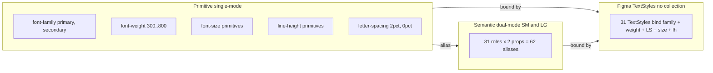

# Typography

## Figma source

- Canonical design-system Figma (Web-ODS-Theme — Design System & tokens): https://www.figma.com/design/Nshd9ukxIzpeUnzOXiWxUP/Web-ODS-Theme
- Primary scale frame: https://www.figma.com/design/Nshd9ukxIzpeUnzOXiWxUP/Web-ODS-Theme?node-id=21009-762&m=dev (1704 × 8582 px; two stacked spec tables — "Headline + Body LG" desktop and "Headline + Body SM" mobile + tablet)
- Secondary scale frame: https://www.figma.com/design/Nshd9ukxIzpeUnzOXiWxUP/Web-ODS-Theme?node-id=21009-1353&m=dev (1704 × 3638 px; both spec tables visibly labeled "Primary" — but the bound family is Playfair Display, so they are Secondary)

## Summary

Typography system — two type families (Primary = Inter Tight, Secondary = Playfair Display) and 31 typography roles (23 Primary + 8 Secondary headings) — surfaced in CSS as role-keyed tokens (`--font-size-*`, `--lineheight-*`, `--letterspacing-*`). Shared role names live in @aics/storybook-lifelock; LifeLock values live in [`themes/default/_tokens.scss`](../../../themes/default/_tokens.scss); utility classes (`.h0`–`.h7`, `.sh0`–`.sh7`) live in the sibling [`_typography.scss`](./_typography.scss). Encodes a binary 1024 px breakpoint switch (no `clamp()`, no fluid scaling).

The chain collapses in CSS — Figma authors a px-keyed primitive layer plus role-keyed semantic aliases, but CSS exposes only the role-keyed names with literal values. Family and weight ship as single-name primitives because they have no role-keyed split.

Two extensions ship alongside the upstream-token sequences:

- **Caption alias** — domain-semantic name for `body/xs`, consumed by the input molecules (Size=M).
- **Button typography** — bundled `font` shorthand and px-based letter-spacing for the Button molecule. Fixed across breakpoints.

## Breakpoint model

Typography is a **binary step at 1024 px**, not a fluid scale. Below 1024 px the **SM** typography scale applies; at and above 1024 px the **LG** typography scale applies. Family, weight, and letter-spacing don't change across the boundary; only `font-size` and `line-height` swap.

The four grid bands defined in [`tokens/breakpoints/spec.md`](../breakpoints/spec.md) collapse to two typography bands:

| Typography band | Grid bands covered | Media query |
|---|---|---|
| SM (typography) | SM (≤ 767) ∪ MD (768–1023) | `@media (max-width: 1023px)` |
| LG (typography) | LG (1024–1439) ∪ XL (≥ 1440) | `@media (min-width: 1024px)` |

Range-bounded, mutually-exclusive — exactly one band matches at any given viewport. Each block declares all 31 role pairs from scratch; there is no mobile-first cascade.

## Layered model

Three layers in Figma; CSS sees only the role-keyed semantics:

1. **Atom primitives** in Primitive collection (single-mode) — 2 families, 6 weights, 15 sizes, 19 line-heights, 2 letter-spacings = **44 atoms**. CSS exposes family + weight as single-name primitives; sizes, line-heights, and letter-spacings collapse into the role-keyed semantic layer below.
2. **Role-keyed semantic aliases** in Semantic collection (**dual-mode: `SM` and `LG`**) — 31 roles × 2 properties (size, lh) = **62 aliases**. Each alias holds a different primitive reference per mode.
3. **Figma TextStyles** in the Styles panel (no collection, no modes) — **31 styles**. Each binds family + default weight + letter-spacing (single-mode primitives) plus size + line-height (mode-aware semantic aliases).



## Token values

> **Figma type primer.** Family is stored as `String`. Weight, size, and line-height are `Number`. Letter-spacing is `Number with %-unit`. CSS surfaces family + weight as primitives and collapses size / lh / letter-spacing to role-keyed tokens with literal values per project conventions.

### Family primitives (CSS-exposed, 2)

| Value | Figma name | Figma type | CSS custom property | Notes |
|---|---|---|---|---|
| `Inter Tight` | `font-family/primary` | String | `--font-family-primary` | sans-serif; bound by all 23 Primary TextStyles |
| `Playfair Display` | `font-family/secondary` | String | `--font-family-secondary` | serif; bound by all 8 Secondary heading TextStyles |

### Weight primitives (CSS-exposed, 6)

| Value | Figma name | Figma type | CSS custom property | Notes |
|---|---|---|---|---|
| 300 | `font-weight/light` | Number | `--font-weight-light` | available across all roles (heading, body, button, label, tagline, secondary-heading) |
| 400 | `font-weight/regular` | Number | `--font-weight-regular` | default weight for `body/*` TextStyles |
| 500 | `font-weight/medium` | Number | `--font-weight-medium` | default weight for `heading/*`, `button/*`, `label`, `tagline/*`, and `secondary-heading/*` TextStyles |
| 600 | `font-weight/semibold` | Number | `--font-weight-semibold` | available across all roles |
| 700 | `font-weight/bold` | Number | `--font-weight-bold` | available across all roles |
| 800 | `font-weight/extrabold` | Number | `--font-weight-extrabold` | **button-only** for Primary; available across all 8 Secondary heading roles |

### Role-keyed size + line-height tokens (CSS-exposed, dual-mode)

31 roles × 2 properties (size, lh) = **62 role-keyed tokens**. Each token is mode-aware via two `:root` blocks (SM defaults + `@media (min-width: 1024px)` LG overrides). Primary roles (23) listed first, Secondary headings (8) second. Spec uses `display` as the Figma label and exposes it as `h0` in CSS to match the project's existing `--font-size-h0 / --lineheight-h0` naming.

| Role (Figma) | SM size / lh | LG size / lh | CSS — size / lh | Available weights | Notes |
|---|---|---|---|---|---|
| `heading/display` | 48 / 56 | 72 / 86 | `--font-size-h0` / `--lineheight-h0` | 300, 400, 500, 600, 700 | Figma: `display`; CSS: `h0` |
| `heading/h1` | 44 / 52 | 64 / 76 | `--font-size-h1` / `--lineheight-h1` | 300, 400, 500, 600, 700 | — |
| `heading/h2` | 36 / 44 | 52 / 62 | `--font-size-h2` / `--lineheight-h2` | 300, 400, 500, 600, 700 | — |
| `heading/h3` | 32 / 40 | 44 / 52 | `--font-size-h3` / `--lineheight-h3` | 300, 400, 500, 600, 700 | — |
| `heading/h4` | 28 / 34 | 36 / 44 | `--font-size-h4` / `--lineheight-h4` | 300, 400, 500, 600, 700 | — |
| `heading/h5` | 24 / 30 | 28 / 34 | `--font-size-h5` / `--lineheight-h5` | 300, 400, 500, 600, 700 | — |
| `heading/h6` | 24 / 30 | 24 / 30 | `--font-size-h6` / `--lineheight-h6` | 300, 400, 500, 600, 700 | sm-collision (≡ h5 SM) |
| `heading/h7` | 20 / 26 | 20 / 26 | `--font-size-h7` / `--lineheight-h7` | 300, 400, 500, 600, 700 | — |
| `body/3xl` | 22 / 32 | 24 / 36 | `--font-size-body-3xl` / `--lineheight-body-3xl` | 300, 400, 500, 600, 700 | — |
| `body/2xl` | 20 / 30 | 22 / 32 | `--font-size-body-2xl` / `--lineheight-body-2xl` | 300, 400, 500, 600, 700 | — |
| `body/xl` | 18 / 26 | 20 / 30 | `--font-size-body-xl` / `--lineheight-body-xl` | 300, 400, 500, 600, 700 | — |
| `body/lg` | 16 / 24 | 18 / 26 | `--font-size-body-lg` / `--lineheight-body-lg` | 300, 400, 500, 600, 700 | — |
| `body/base` | 14 / 22 | 16 / 24 | `--font-size-body-base` / `--lineheight-body-base` | 300, 400, 500, 600, 700 | — |
| `body/sm` | 14 / 22 | 14 / 22 | `--font-size-body-sm` / `--lineheight-body-sm` | 300, 400, 500, 600, 700 | sm-collision (≡ body/base SM) |
| `body/xs` | 12 / 18 | 12 / 18 | `--font-size-body-xs` / `--lineheight-body-xs` | 300, 400, 500, 600, 700 | aliased by the `caption` extension below |
| `button/xl` | 18 / 24 | 20 / 26 | `--font-size-button-xl` / `--lineheight-button-xl` | 400, 500, 700, 800 | — |
| `button/lg` | 16 / 20 | 18 / 24 | `--font-size-button-lg` / `--lineheight-button-lg` | 400, 500, 700, 800 | — |
| `button/base` | 14 / 18 | 16 / 20 | `--font-size-button-base` / `--lineheight-button-base` | 400, 500, 700, 800 | — |
| `button/sm` | 14 / 18 | 14 / 18 | `--font-size-button-sm` / `--lineheight-button-sm` | 400, 500, 700, 800 | sm-collision (≡ button/base SM) |
| `label/default` | 12 / 16 | 12 / 16 | `--font-size-label` / `--lineheight-label` | 300, 400, 500, 600, 700 | — |
| `tagline/lg` | 16 / 24 | 18 / 22 | `--font-size-tagline-lg` / `--lineheight-tagline-lg` | 300, 400, 500, 600, 700 | — |
| `tagline/md` | 16 / 24 | 16 / 20 | `--font-size-tagline-md` / `--lineheight-tagline-md` | 300, 400, 500, 600, 700 | sm-collision (≡ tagline/lg SM) |
| `tagline/sm` | 14 / 22 | 14 / 22 | `--font-size-tagline-sm` / `--lineheight-tagline-sm` | 300, 400, 500, 600, 700 | — |
| `secondary-heading/display` | 48 / 58 | 72 / 86 | `--font-size-secondary-h0` / `--lineheight-secondary-h0` | 400, 500, 600, 700, 800 | Figma: `secondary-heading/display`; CSS: `secondary-h0`. Uses Playfair-tuned `line-height: 58px` SM. |
| `secondary-heading/h1` | 44 / 52 | 64 / 76 | `--font-size-secondary-h1` / `--lineheight-secondary-h1` | 400, 500, 600, 700, 800 | — |
| `secondary-heading/h2` | 36 / 44 | 52 / 62 | `--font-size-secondary-h2` / `--lineheight-secondary-h2` | 400, 500, 600, 700, 800 | — |
| `secondary-heading/h3` | 32 / 38 | 44 / 52 | `--font-size-secondary-h3` / `--lineheight-secondary-h3` | 400, 500, 600, 700, 800 | Playfair-tuned `line-height: 38px` SM |
| `secondary-heading/h4` | 28 / 34 | 36 / 44 | `--font-size-secondary-h4` / `--lineheight-secondary-h4` | 400, 500, 600, 700, 800 | — |
| `secondary-heading/h5` | 24 / 30 | 28 / 34 | `--font-size-secondary-h5` / `--lineheight-secondary-h5` | 400, 500, 600, 700, 800 | — |
| `secondary-heading/h6` | 24 / 30 | 24 / 30 | `--font-size-secondary-h6` / `--lineheight-secondary-h6` | 400, 500, 600, 700, 800 | sm-collision (≡ secondary h5 SM) |
| `secondary-heading/h7` | 20 / 26 | 20 / 26 | `--font-size-secondary-h7` / `--lineheight-secondary-h7` | 400, 500, 600, 700, 800 | — |

### Letter-spacing tokens (CSS-exposed, role-keyed, single-mode)

Per-family rule: every Primary role gets `0.02em`, every Secondary heading role gets `0`. Figma stores the values as percentages (`letter-spacing/2pct`, `letter-spacing/0pct`); CSS emits them as `em` for broader browser support (`1em = 100%` of the role's font-size, so `2% ↔ 0.02em` exactly).

| Role group | Figma value | CSS value | CSS custom property |
|---|---|---|---|
| Primary headings (`h0`–`h7`) | `2%` | `0.02em` | `--letterspacing-h0`, `--letterspacing-h1`, `--letterspacing-h2`, `--letterspacing-h3`, `--letterspacing-h4`, `--letterspacing-h5`, `--letterspacing-h6`, `--letterspacing-h7` |
| Body (`3xl`–`xs`) | `2%` | `0.02em` | `--letterspacing-body-3xl`, `--letterspacing-body-2xl`, `--letterspacing-body-xl`, `--letterspacing-body-lg`, `--letterspacing-body-base`, `--letterspacing-body-sm`, `--letterspacing-body-xs` |
| Button (`xl`–`sm`) | `2%` (family rule); see Button-typography extension below for the px-based override the Button molecule uses | `0.02em` (family rule); px override per Button extension | `--letterspacing-button-xl`, `--letterspacing-button-lg`, `--letterspacing-button-base`, `--letterspacing-button-sm` |
| Label | `2%` | `0.02em` | `--letterspacing-label` |
| Tagline (`lg`–`sm`) | `2%` | `0.02em` | `--letterspacing-tagline-lg`, `--letterspacing-tagline-md`, `--letterspacing-tagline-sm` |
| Secondary headings (`secondary-h0`–`secondary-h7`) | `0%` | `0` | `--letterspacing-secondary-h0`, `--letterspacing-secondary-h1`, `--letterspacing-secondary-h2`, `--letterspacing-secondary-h3`, `--letterspacing-secondary-h4`, `--letterspacing-secondary-h5`, `--letterspacing-secondary-h6`, `--letterspacing-secondary-h7` |

**Why `em`, not `%`.** CSS `letter-spacing` accepts `<length>` and `normal`; percentage values are not in the CSS Text spec and are not honoured consistently across browsers (Safari notably drops them). `em` is the portable equivalent — it resolves against the element's `font-size` exactly the way Figma's `%` does. The conversion is a literal divide by 100: `2% → 0.02em`, `5% → 0.05em`, `0% → 0` (which collapses to the unit-less `0`).

### TextStyles (Figma Styles panel — no collection, no modes)

31 TextStyles. Each binds five properties (family + default weight + letter-spacing + size + line-height). The "default" weight column is the one bound to the TextStyle. Components needing a different weight (e.g. Bold H3, ExtraBold Button) override `font-weight` at the consumer level rather than create extra TextStyles per weight.

| TextStyle name | Family | Weight (default) | Letter spacing | Size | Line height |
|---|---|---|---|---|---|
| `text/heading/display` | `font-family/primary` | `font-weight/medium` (500) | `letter-spacing/2pct` | → `--font-size-h0` (mode-aware) | → `--lineheight-h0` |
| `text/heading/h1` | `font-family/primary` | `font-weight/medium` | `letter-spacing/2pct` | → `--font-size-h1` | → `--lineheight-h1` |
| `text/heading/h2` … `h7` | `font-family/primary` | `font-weight/medium` | `letter-spacing/2pct` | → `--font-size-h{n}` | → `--lineheight-h{n}` |
| `text/body/3xl` … `xs` | `font-family/primary` | `font-weight/regular` (400) | `letter-spacing/2pct` | → `--font-size-body-{size}` | → `--lineheight-body-{size}` |
| `text/button/xl` … `sm` | `font-family/primary` | `font-weight/medium` | `letter-spacing/2pct` | → `--font-size-button-{size}` | → `--lineheight-button-{size}` |
| `text/label/default` | `font-family/primary` | `font-weight/medium` | `letter-spacing/2pct` | → `--font-size-label` | → `--lineheight-label` |
| `text/tagline/lg` … `sm` | `font-family/primary` | `font-weight/medium` | `letter-spacing/2pct` | → `--font-size-tagline-{size}` | → `--lineheight-tagline-{size}` |
| `text/secondary-heading/display` | `font-family/secondary` | `font-weight/medium` | `letter-spacing/0pct` | → `--font-size-secondary-h0` | → `--lineheight-secondary-h0` |
| `text/secondary-heading/h1` … `h7` | `font-family/secondary` | `font-weight/medium` | `letter-spacing/0pct` | → `--font-size-secondary-h{n}` | → `--lineheight-secondary-h{n}` |

## Class strategy

Two utility-class families ship — one per typeface — alongside the role-keyed custom properties.

### Primary — element + class selectors

Headings are addressable via either bare element selectors (`h1`–`h6`) or utility classes (`.h0`–`.h7`). `.h0` and `.h7` are class-only because `<h0>` / `<h7>` aren't HTML tags. Both element and class read from the same role-keyed semantic vars, so semantic and visual hierarchy can be chosen independently (e.g. `<h1 class="h0">` for the largest `display` role on a semantically-correct h1; `<h2 class="h6">` to demote).

```css
h1, .h1 {
  font-family:    var(--font-family-primary);
  font-weight:    var(--font-weight-medium);
  letter-spacing: var(--letterspacing-h1);
  font-size:      var(--font-size-h1);
  line-height:    var(--lineheight-h1);
}

.h0 {
  font-family:    var(--font-family-primary);
  font-weight:    var(--font-weight-medium);
  letter-spacing: var(--letterspacing-h0);
  font-size:      var(--font-size-h0);
  line-height:    var(--lineheight-h0);
}
```

Body / button / label / tagline ship as custom properties only — no utility classes. Consumers compose them on chosen elements.

### Secondary — class selectors only

Secondary type is a brand re-skin with no native HTML root, so there are NO element selectors. Eight utility classes ship: **`.sh0`–`.sh7`**. Apply on any element (`<h1 class="sh0">Editorial display</h1>`, `<h2 class="sh1">Editorial title</h2>`).

```css
.sh0, .sh1, .sh2, .sh3, .sh4, .sh5, .sh6, .sh7 {
  font-family: var(--font-family-secondary);
  font-weight: var(--font-weight-medium);
  margin: 0;
}

.sh1 {
  font-size:      var(--font-size-secondary-h1);
  line-height:    var(--lineheight-secondary-h1);
  letter-spacing: var(--letterspacing-secondary-h1);
}
/* ... .sh0, .sh2..sh7 follow the same pattern */
```

`.sh*` and Primary's `.h*` have identical specificity. When both are present on one element the **last-declared rule wins** (source order). Authors should pick one or the other per element.

## CSS implementation pattern

Range-bounded, non-overlapping queries (matches the grid model). All 31 role pairs are declared in each band block inside [`themes/default/_tokens.scss`](../../../themes/default/_tokens.scss) — no `:root` cascade fallback for size / lh. Shared names are listed in the core contract; secondary-h* remain brand-local.

```css
:root {
  /* Family + weight primitives (single-mode) */
  --font-family-primary:
    "Inter Tight", -apple-system, BlinkMacSystemFont, "Segoe UI", system-ui, sans-serif;
  --font-family-secondary:
    "Playfair Display", georgia, "Times New Roman", serif;

  --font-weight-light:     300;
  --font-weight-regular:   400;
  --font-weight-medium:    500;
  --font-weight-semibold:  600;
  --font-weight-bold:      700;
  --font-weight-extrabold: 800;

  /* Letter-spacing per role (single-mode; family-level rule).
     Figma authors percentages (`2pct` / `0pct`); CSS emits as `em`
     because CSS `letter-spacing` doesn't accept `%` portably.
     1em = 100% of the role's font-size, so 2% ↔ 0.02em exactly. */
  --letterspacing-h0: 0.02em;
  --letterspacing-h1: 0.02em;
  /* ... 0.02em on every Primary role ... */
  --letterspacing-secondary-h0: 0;
  --letterspacing-secondary-h1: 0;
  /* ... 0 on every Secondary heading ... */
}

@media (max-width: 1023px) {
  :root {
    /* 31 role pairs at SM defaults — literal values, no var() chain */
    --font-size-h0: 48px;            --lineheight-h0: 56px;
    --font-size-h1: 44px;            --lineheight-h1: 52px;
    --font-size-h2: 36px;            --lineheight-h2: 44px;
    --font-size-h3: 32px;            --lineheight-h3: 40px;
    --font-size-h4: 28px;            --lineheight-h4: 34px;
    --font-size-h5: 24px;            --lineheight-h5: 30px;
    --font-size-h6: 24px;            --lineheight-h6: 30px;
    --font-size-h7: 20px;            --lineheight-h7: 26px;
    --font-size-body-3xl: 22px;      --lineheight-body-3xl: 32px;
    --font-size-body-2xl: 20px;      --lineheight-body-2xl: 30px;
    --font-size-body-xl: 18px;       --lineheight-body-xl: 26px;
    --font-size-body-lg: 16px;       --lineheight-body-lg: 24px;
    --font-size-body-base: 14px;     --lineheight-body-base: 22px;
    --font-size-body-sm: 14px;       --lineheight-body-sm: 22px;
    --font-size-body-xs: 12px;       --lineheight-body-xs: 18px;
    --font-size-button-xl: 18px;     --lineheight-button-xl: 24px;
    --font-size-button-lg: 16px;     --lineheight-button-lg: 20px;
    --font-size-button-base: 14px;   --lineheight-button-base: 18px;
    --font-size-button-sm: 14px;     --lineheight-button-sm: 18px;
    --font-size-label: 12px;         --lineheight-label: 16px;
    --font-size-tagline-lg: 16px;    --lineheight-tagline-lg: 24px;
    --font-size-tagline-md: 16px;    --lineheight-tagline-md: 24px;
    --font-size-tagline-sm: 14px;    --lineheight-tagline-sm: 22px;
    --font-size-secondary-h0: 48px;  --lineheight-secondary-h0: 58px;
    --font-size-secondary-h1: 44px;  --lineheight-secondary-h1: 52px;
    --font-size-secondary-h2: 36px;  --lineheight-secondary-h2: 44px;
    --font-size-secondary-h3: 32px;  --lineheight-secondary-h3: 38px;
    --font-size-secondary-h4: 28px;  --lineheight-secondary-h4: 34px;
    --font-size-secondary-h5: 24px;  --lineheight-secondary-h5: 30px;
    --font-size-secondary-h6: 24px;  --lineheight-secondary-h6: 30px;
    --font-size-secondary-h7: 20px;  --lineheight-secondary-h7: 26px;
  }
}

@media (min-width: 1024px) {
  :root {
    /* same 31 role pairs at LG */
    --font-size-h0: 72px;            --lineheight-h0: 86px;
    --font-size-h1: 64px;            --lineheight-h1: 76px;
    --font-size-h2: 52px;            --lineheight-h2: 62px;
    --font-size-h3: 44px;            --lineheight-h3: 52px;
    --font-size-h4: 36px;            --lineheight-h4: 44px;
    --font-size-h5: 28px;            --lineheight-h5: 34px;
    --font-size-h6: 24px;            --lineheight-h6: 30px;
    --font-size-h7: 20px;            --lineheight-h7: 26px;
    --font-size-body-3xl: 24px;      --lineheight-body-3xl: 36px;
    --font-size-body-2xl: 22px;      --lineheight-body-2xl: 32px;
    --font-size-body-xl: 20px;       --lineheight-body-xl: 30px;
    --font-size-body-lg: 18px;       --lineheight-body-lg: 26px;
    --font-size-body-base: 16px;     --lineheight-body-base: 24px;
    --font-size-body-sm: 14px;       --lineheight-body-sm: 22px;
    --font-size-body-xs: 12px;       --lineheight-body-xs: 18px;
    --font-size-button-xl: 20px;     --lineheight-button-xl: 26px;
    --font-size-button-lg: 18px;     --lineheight-button-lg: 24px;
    --font-size-button-base: 16px;   --lineheight-button-base: 20px;
    --font-size-button-sm: 14px;     --lineheight-button-sm: 18px;
    --font-size-label: 12px;         --lineheight-label: 16px;
    --font-size-tagline-lg: 18px;    --lineheight-tagline-lg: 22px;
    --font-size-tagline-md: 16px;    --lineheight-tagline-md: 20px;
    --font-size-tagline-sm: 14px;    --lineheight-tagline-sm: 22px;
    --font-size-secondary-h0: 72px;  --lineheight-secondary-h0: 86px;
    --font-size-secondary-h1: 64px;  --lineheight-secondary-h1: 76px;
    --font-size-secondary-h2: 52px;  --lineheight-secondary-h2: 62px;
    --font-size-secondary-h3: 44px;  --lineheight-secondary-h3: 52px;
    --font-size-secondary-h4: 36px;  --lineheight-secondary-h4: 44px;
    --font-size-secondary-h5: 28px;  --lineheight-secondary-h5: 34px;
    --font-size-secondary-h6: 24px;  --lineheight-secondary-h6: 30px;
    --font-size-secondary-h7: 20px;  --lineheight-secondary-h7: 26px;
  }
}
```

Example role-class:

```css
.brand-heading-h1 {
  font-family:    var(--font-family-primary);
  font-weight:    var(--font-weight-medium);
  letter-spacing: var(--letterspacing-h1);
  font-size:      var(--font-size-h1);
  line-height:    var(--lineheight-h1);
}

.brand-secondary-heading-h1 {
  font-family:    var(--font-family-secondary);
  font-weight:    var(--font-weight-medium);
  letter-spacing: var(--letterspacing-secondary-h1);
  font-size:      var(--font-size-secondary-h1);
  line-height:    var(--lineheight-secondary-h1);
}
```

No `clamp()` is used for typography sizing — the spec is a binary step at 1024 px, not a fluid scale.

## Extension: Caption alias

Adds **1 semantic role alias** (`caption`) to the existing role-keyed surface. **No new Figma primitives** — `caption` aliases to the already-shipped `body/xs` role pair (12 / 18 px in both modes).

### Why

The `base-input` molecule binds typography per Size — `Size=L` consumes `text/body/base` (16 / 24 px LG mode), `Size=M` consumes `text/caption` (legacy 13 / 18 px). The legacy "Caption" role is not in the primary-typography role list (the closest existing role is `body/xs` at 12 / 18 px). Surfacing `caption` as a CSS alias to `body/xs` gives the input family a domain-semantic name without adding a new primitive — the 1 px size delta from legacy 13 → 12 is acceptable normalization to the existing 2-px-step scale.

### Token values

| Role | SM size / lh | LG size / lh | Aliases to (existing) | CSS — size / lh | Notes |
|---|---|---|---|---|---|
| `caption` | 12 / 18 | 12 / 18 | `body/xs` role | `--font-size-caption` / `--lineheight-caption` | Used by `base-input` Size=M, `password` / `text-input` / `picker` Size=M, `label` Size=Sm. |

### CSS form

```css
:root {
  --font-size-caption:  var(--font-size-body-xs);
  --lineheight-caption: var(--lineheight-body-xs);
}
```

No `@media (min-width: 1024px)` re-point needed — `body/xs` resolves to the same value (12 / 18) in SM and LG modes.

### Locked decisions

1. **No new primitive at 13 px** — the 1 px size delta from legacy 13 → 12 normalizes the input M typography to the existing 2-px-step scale (12, 14, 16, 18, …). At 13 vs. 12 px the visual delta is sub-pixel on most displays.
2. **Alias chain at the role layer** — `--font-size-caption` resolves through `--font-size-body-xs`. Re-targeting `body/xs` later (e.g. bumping it to 13 px) propagates to caption automatically.
3. **No `caption` TextStyle in Figma** — the input molecules don't bind to a Figma TextStyle (their per-cell text is set ad-hoc); this extension ships the CSS aliases only.
4. **No SM / LG split** — caption inherits whatever `body/xs` is in each mode. Today both modes are 12 / 18.

## Extension: Button typography

Buttons need a different shape from heading / body / tagline / label: **bundled `font` shorthand**, **fixed across breakpoints** (button labels resize via padding, not via type), and **px-based letter-spacing** (Figma carries `0.24px` / `0.32px`, not `2%`).

### Token values

| Group | Property | Value | Notes |
|---|---|---|---|
| `font/button/sm` | family | Inter Tight | Button Size = sm |
| `font/button/sm` | weight | 500 | — |
| `font/button/sm` | size | 14 | — |
| `font/button/sm` | line-height | 18 | — |
| `font/button/sm` | letter-spacing | 0.24px | legacy parity |
| `font/button/base` | family | Inter Tight | Button Sizes = md / lg / xl |
| `font/button/base` | weight | 500 | — |
| `font/button/base` | size | 16 | — |
| `font/button/base` | line-height | 24 | — |
| `font/button/base` | letter-spacing | 0.32px | legacy parity |

### Figma

- 2 new TextStyles in the Styles panel: `font/button/sm`, `font/button/base`.
- Each binds family + weight + size + line-height inline (no Semantic alias variables — single shape, no breakpoint mode swap).
- Coexist with the dual-mode `text/button/{sm,base,lg,xl}` styles (those follow the body/heading shape and are NOT used by the Button molecule).

### CSS

Figma authors per-button-size letter-spacing primitives (`letter-spacing/button/sm = 0.24px`, `letter-spacing/button/base = 0.32px`); CSS exposes them at the role-keyed layer per project convention. These px-based tokens override the family-level rule (`0.02em`, mirrored from the Figma `2pct` primitive) for the Button molecule specifically (matches `--letterspacing-button-{xl,lg,base,sm}` in `_tokens.scss`).

```css
:root {
  /* Button label letter-spacing — px values, not the family-wide 2% */
  --letterspacing-button-sm:   0.24px;
  --letterspacing-button-base: 0.32px;

  /* Button label `font` shorthand — single shape across SM and LG */
  --font-button-sm:   500 14px / 18px var(--font-family-primary);
  --font-button-base: 500 16px / 24px var(--font-family-primary);
}
```

Consumers compose: `font: var(--font-button-base); letter-spacing: var(--letterspacing-button-base);`.

### Locked decisions

1. **Two shapes, not four** — `sm` for size = sm, `base` for sizes md / lg / xl. Same letter-spacing across md/lg/xl (label tracking is constant; only padding scales).
2. **`font` shorthand, not separate size + lh aliases** — buttons use one combined shape, so the shorthand is more ergonomic than a `--font-size-button-base` / `--lineheight-button-base` pair (the role-keyed `--font-size-button-*` / `--lineheight-button-*` tokens still exist for non-Button-molecule consumers).
3. **Fixed across breakpoints** — no `@media` swap for button typography. Differs from heading / body / tagline / label, which all flip at 1024 px.
4. **px letter-spacing, not `2%`** — preserved from legacy Figma; matches the per-button-size tracking in the Button spec.
5. **Coexists with existing `text/button/*` TextStyles** — the new `font/button/*` family is the canonical button label shape.

## Font loading

The design system depends on **two web font families** — Inter Tight (Primary) and Playfair Display (Secondary). Both families load from Google Fonts in a single request, with resource hints, and expose the families to the design system via the `--font-family-primary` / `--font-family-secondary` primitives.

### Resource hints

These two `<link rel="preconnect">` tags MUST appear in the consumer page `<head>` before the Google Fonts stylesheet `<link>`. They open the DNS / TLS handshake to Google's CSS host and font-binary host in parallel.

```html
<link rel="preconnect" href="https://fonts.googleapis.com" />
<link rel="preconnect" href="https://fonts.gstatic.com" crossorigin />
```

The `crossorigin` attribute on the `gstatic` preconnect is required — font binaries are served as anonymous CORS requests.

### Google Fonts stylesheet (verbatim)

```html
<link
  href="https://fonts.googleapis.com/css2?family=Inter+Tight:wght@300;400;500;600;700;800&family=Playfair+Display:wght@400;500;600;700;800&display=swap"
  rel="stylesheet"
/>
```

The URL loads exactly the families and weights documented below.

| Family | Weights loaded | Bound to | Used by |
|---|---|---|---|
| `Inter Tight` | 300, 400, 500, 600, 700, 800 | `font-family/primary` (Primitive) → `--font-family-primary` | All 23 Primary roles. ExtraBold 800 is button-only. |
| `Playfair Display` | 400, 500, 600, 700, 800 | `font-family/secondary` (Primitive) → `--font-family-secondary` | All 8 Secondary heading roles. **No Light 300** (Playfair Display ships no Light face). |

### `display=swap` rationale

The `display=swap` query-string parameter is **required**. It instructs the browser to render text immediately in the fallback face and swap to the web font when it loads. This eliminates Flash of Invisible Text (FOIT) and keeps Largest Contentful Paint within the performance budget.

### Fallback stacks

Declared at the SCSS primitive layer:

| Primitive | SCSS value |
|---|---|
| `--font-family-primary` | `"Inter Tight", -apple-system, BlinkMacSystemFont, "Segoe UI", system-ui, sans-serif` |
| `--font-family-secondary` | `"Playfair Display", georgia, "Times New Roman", serif` |

Both stacks resolve gracefully when the Google Fonts request is blocked, fails, or is delayed past the `display=swap` window. Visual diff against the loaded web font is acceptable — fallbacks are picked for character-width similarity (`-apple-system` / Segoe UI for Inter Tight; Georgia for Playfair Display) so layout shift on swap is minimal.

## Design decisions

- **Two type families.** Primary = Inter Tight (`font-family/primary`); Secondary = Playfair Display (`font-family/secondary`). The legacy `font/family/primary/heading` + `font/family/primary/body` (both Inter Tight) collapse to one Primary primitive. The legacy `font/family/secondary/heading` (with no `body` counterpart) collapses to `font-family/secondary` since Secondary is heading-only in this scope.
- **6 weights for Primary, 5 for Secondary.** Primary uses `300/400/500/600/700/800`; ExtraBold 800 is **button-only**. Secondary uses `400/500/600/700/800` — Light 300 is **not loaded** (Playfair Display ships no Light face). Secondary's ExtraBold 800 is available across all 8 heading roles (no button-only restriction — Secondary has no button family).
- **Letter-spacing per family.** Primary = `2%` (Figma) → `0.02em` (CSS) on every role. Secondary = `0%` (Figma) → `0` (CSS) on every role. Stored in Figma as two single-percentage primitives (`letter-spacing/2pct`, `letter-spacing/0pct`); CSS exposes them as per-role `em`-typed tokens (`--letterspacing-{role}`) because CSS `letter-spacing` does not accept `%` portably. `1em` resolves against the role's font-size exactly the way Figma's `%` does, so the conversion is a literal divide-by-100. The Button-typography extension overrides the family rule with px-based per-size values.
- **31 roles total.** 23 Primary (display + h1–h7 = 8 headings, body 3xl/2xl/xl/lg/base/sm/xs = 7, button xl/lg/base/sm = 4, label = 1, tagline lg/md/sm = 3) + 8 Secondary headings (display + h1–h7).
- **`display` → `h0` in CSS.** Figma uses the human-friendly `display` label; CSS maps to `--font-size-h0` / `--lineheight-h0` per project convention. Same rule applies for `secondary-heading/display` → `--font-size-secondary-h0`.
- **`h7` is a first-class role.** Both families ship h0 (display) through h7 in both SM and LG. Component consumers may target h7 for fine-grained heading hierarchy beyond h6.
- **Headings only in v1 for Secondary.** The legacy Secondary scale has no body, button, label, or tagline variants. Recommend NOT inventing them; downstream component specs that need a "secondary body" treatment will request additions then.
- **`playfair-no-light`** — Playfair Display does NOT ship a Light 300 face. Available faces are Regular 400, Medium 500, SemiBold 600, Bold 700, ExtraBold 800, Black 900 (plus italics). Components requesting Light on a Secondary heading must fall back to Regular or use a Primary class.
- **No Bold-specific Secondary TextStyle.** Primary has `PRIMARY/H3/Bold` as a registered text style; Secondary does not. Bold weight (700) is still in scope as an *available* weight, but no Bold-specific Secondary TextStyle is created.
- **SM-mode collisions in Primary kept verbatim.** 4 pairs have identical SM values: `heading/h6 ≡ heading/h5` (24/30), `body/sm ≡ body/base` (14/22), `button/sm ≡ button/base` (14/18), `tagline/md ≡ tagline/lg` (16/24). Roles stay distinct because component consumers carry semantic intent that the value collision doesn't override.
- **SM-mode collision in Secondary kept verbatim.** `secondary-heading/h6 ≡ secondary-heading/h5` (24/30), same rationale as Primary.
- **Secondary line-heights `38` and `58` are designer-intentional.** Playfair Display (serif) vertical metrics differ from Inter Tight (sans) at the same px size — `secondary-heading/h3 SM` uses `line-height: 38px` (2 px tighter than Primary's 40 at the same 32 px size), `secondary-heading/display SM` uses `line-height: 58px` (2 px looser than Primary's 56 at the same 48 px size). Per-typeface tuning preserved.
- **Class strategy mirrors typeface convention.** Primary ships element selectors (`h1`–`h6`) AND utility classes (`.h0`–`.h7`) because it has a native HTML root for headings. Secondary ships utility classes only (`.sh0`–`.sh7`) because it's a brand re-skin with no native HTML root. `.sh*` and `.h*` have identical specificity — last-declared rule wins, authors pick one or the other per element.
- **Binary breakpoint at 1024 px.** Typography uses one breakpoint switch; the grid's MD threshold (768) is not a typography boundary. Tablet portrait (768–1023) keeps the SM type ramp (`h0 = 48px`); LG values (`h0 = 72px`) only kick in at desktop (≥ 1024 px).
- **Range-bounded media queries.** Mirrors the grid model; both bands declared explicitly, no `:root`-only mobile-first cascade. All 31 role pairs redeclare in each band — the cascade is intentionally not load-bearing.
- **Lifelock storybook is already aligned.** [`themes/default/_tokens.scss`](../../../themes/default/_tokens.scss) ships the canonical range-bounded form: two mutually exclusive `@media` blocks (`max-width: 1023px` and `min-width: 1024px`) redeclare every role pair from scratch. [`_typography.scss`](./_typography.scss) only ships utility classes. Legacy multi-brand tokens under `legacy/storybook/` retain a mobile-first shape breaking at 768 px and are outside this spec's scope.
- **No `clamp()`.** Typography is a binary step, not fluid.
- **No CSS-side primitive layer for size / lh / letter-spacing.** Figma keeps the px-keyed primitives so designers can re-target a value without touching every role; CSS surfaces only the role-keyed tokens with literal values per the project's flat-naming rule (`code-conventions.mdc` § 4).
